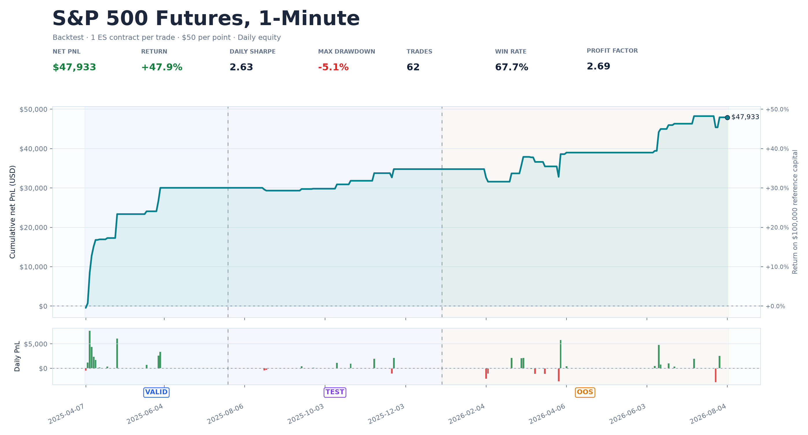
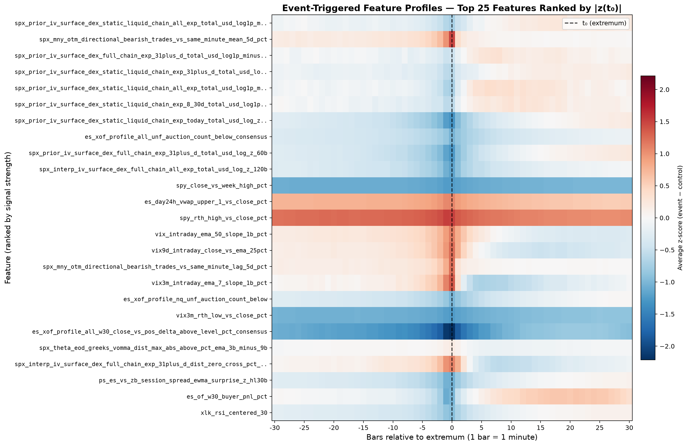
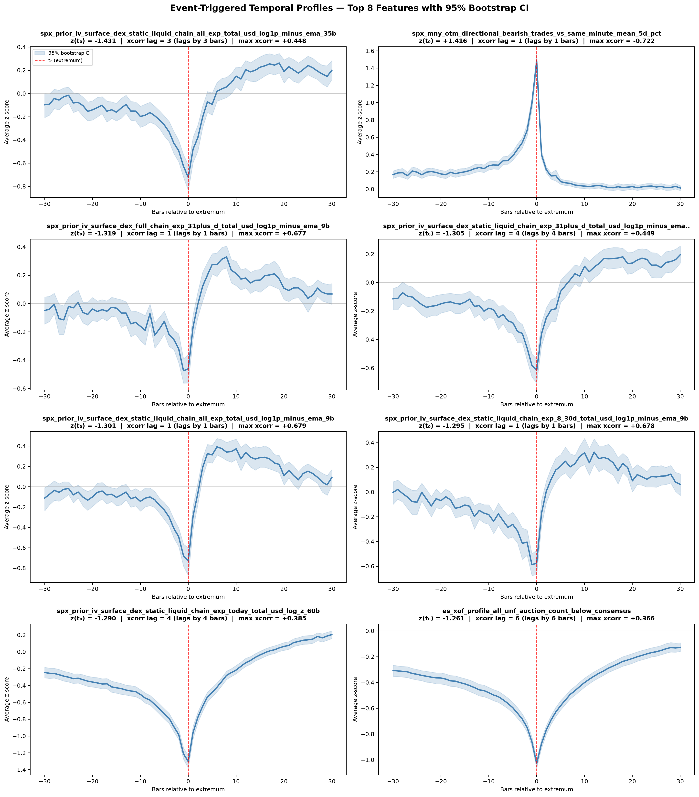
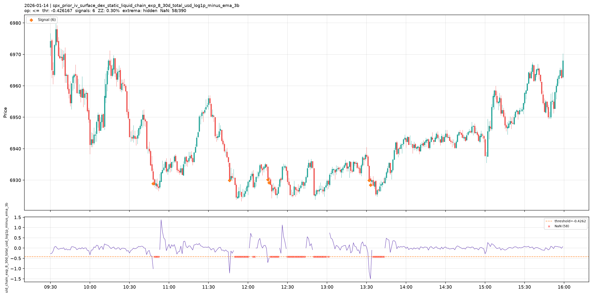

# Options Flow Market State Research

Quantitative research on forecasting intraday futures direction from options microstructure, futures order flow, technical structure, cross market relationships, and machine learning.

The chart above presents a one ES contract research simulation across validation, test, and later replay data from April 2025 through August 2026. It shows $47,933 of arithmetic net PnL on $100,000 of reference capital, a daily Sharpe ratio of 2.63, a 5.07 percent closed daily equity drawdown, 62 trades, an average trade of about $773, and a 2.69 profit factor. The average trade is shown in dollars because the equivalent 15.5 ES points, or about 0.26 percent of ES price, uses the futures price as its denominator rather than the $100,000 reference capital. It is a selected diagnostic simulation, not a live trading record or an unbiased estimate of expected return. The exact execution assumptions, selection history, sample size, and mark to market risk are described later.

## Research Objective

> I do not expect one indicator, one option expiration, or one market narrative to explain price consistently. I treat the market as a partially observed and regime dependent system. My task is to describe that system richly enough for stable relationships to become measurable.

The purpose of this project is to predict short horizon price movement in assets whose derivatives markets contain meaningful information about positioning, hedging pressure, volatility expectations, and liquidity. My primary research path maps SPX and SPXW index options into ES futures signals and treats SPY options as a parallel liquid source of listed equity risk. The same architecture extends to NDX and NDXP, QQQ options for NQ, and RUT and RUTW, IWM options for RTY. The underlying logic can also be applied to liquid single stocks with active options markets, including AAPL, MSFT, NVDA, TSLA, AMZN, META, GOOGL, and AVGO.

I work on a one minute clock during the United States regular session. Every session is defined in America/New_York time from 09:30 through 16:00, which gives exactly 390 observations per complete trading day. Each minute represents only information available by the end of that minute.

I chose one minute resolution for a specific reason. The horizon is short enough to preserve the sequence of flow, liquidity, and price response, but long enough to aggregate fragmented option prints into a state that can be processed over several years. Tick data retains more detail, yet it also makes quote synchronization, exchange latency, and order reconstruction much harder. Five or fifteen minute bars are computationally easier, but they can merge the event, the market reaction, and the first reversal into the same observation. One minute is therefore a practical compromise between market microstructure and statistical sample size.

The research process has six goals:

1. Measure what happened in the options and futures markets during each minute.
2. Convert raw measurements into causal and scale aware descriptions of market state.
3. Construct many economically distinct prediction targets instead of assuming one trading objective is correct.
4. Test which combinations remain useful through chronological validation, test, and later data.
5. Separate predictive ranking from calibration, execution, and risk.
6. Preserve enough evidence to explain why a model succeeded or failed.

I approach the market as a trader and as a researcher. The trader asks whether a signal can be entered, sized, managed, and exited under realistic constraints. The researcher asks whether the information existed before the decision, whether the result survives a different period, and whether a simpler explanation can reproduce it. Both views are necessary. A statistically attractive pattern can be impossible to execute, while a profitable historical curve can be produced by selection rather than information.

## How I Frame the Market

> Price is the visible output of a hidden system. Options positioning, futures auction structure, volatility, liquidity, and cross market capital flows are imperfect observations of that system.

I do not begin with the assumption that call buying makes the market rise or that negative gamma makes every move accelerate. Those statements can be useful hypotheses, but their effect depends on expiration, strike location, trade initiation, inventory, volatility regime, time remaining in the session, and the state of the underlying auction.

A useful abstraction is:

$$X_t = g(S_{\leq t}) + \varepsilon_t$$

Here, $S_t$ is the latent economic state, $X_t$ is the feature vector observed by the end of minute $t$, $g$ is the complete data and feature pipeline, and $\varepsilon_t$ contains measurement error. That error includes quote noise, uncertain aggressor classification, stale open interest, implied volatility estimation error, aggregation effects, and differences between the SPX cash coordinate and the tradable ES futures coordinate.

The model does not observe investor intent directly. It observes transactions, quotes, positions reported at the previous close, and the subsequent shape of prices. The research problem is therefore probabilistic. I ask whether the current measurement set changes the conditional distribution of a future event:

$$P(Y_{t,h}=1 \mid X_t, \mathcal{I}_t)$$

where $\mathcal{I}_t$ represents simpler information already known at minute $t$, such as recent returns, volatility, time of day, and market regime. The objective is not to claim that every selected feature has a structural causal effect. The objective is to determine whether the joint options and futures state contains incremental predictive information.

This framing leads to several explicit hypotheses:

1. Options positioning and volatility surface geometry contain information beyond futures price history.
2. Futures order flow contributes information that is not present in the options chain.
3. Peaks and troughs are asymmetric processes and should not be forced into one symmetric model.
4. Relative and stationary representations transfer through time better than raw dollar or price levels.
5. Probability ranking transfers more reliably than one fixed probability threshold.
6. A signal must survive costs, entry delay, position conflicts, and exit logic before it becomes a trading result.
7. A selected strategy must be compared with plausible null strategies and nearby parameter choices.

Each hypothesis can fail independently. This matters because one strong equity curve cannot prove the complete chain. A model may rank extrema well but produce poor trades. A strategy may profit because it selects good days but fail to time entries. A feature may be useful as a proxy without identifying the underlying economic cause.

## Scientific Method and Claim Hierarchy

> A large search will always produce attractive results. My standard is not whether I can find one, but whether I can explain its origin, reproduce it, and define what evidence would invalidate it.

I distinguish five levels of evidence:


| Level       | Question                                                         | Required evidence                                                       |
| ----------- | ---------------------------------------------------------------- | ----------------------------------------------------------------------- |
| Measurement | Did the pipeline describe observed market activity consistently? | Schema checks, coverage, timestamps, deterministic aggregation          |
| Association | Do model scores rank future outcomes better than chance?         | Chronological ROC AUC and PR AUC                                        |
| Calibration | Does a score retain a stable probability meaning?                | Reliability curves, Brier score, calibration slope                      |
| Execution   | Can a causal policy convert scores into net PnL?                 | Delayed fills, costs, position state, exits, mark to market risk        |
| Production  | Is the complete process ready for deployment?                    | Frozen rules, live parity, operational controls, untouched forward data |


This project provides strong historical evidence at the measurement and ranking levels. Calibration and execution evidence is mixed. I do not make a production performance claim.

The main predictive null can be written as:

$$H_0: P(Y_{t,h}=1 \mid X_t,\mathcal{I}_t) = P(Y_{t,h}=1 \mid \mathcal{I}_t)$$

The alternative says that the richer market state contains incremental ranking information. Rejecting this null historically is only the first step. The result must then survive regime changes, prevalence changes, correlated observations, repeated model selection, and an execution model.

I also separate temporal causality from causal inference. A feature is temporally causal when it can be computed from information available at decision time. If:

$$\mathcal{F}_t = \sigma\{D_u : u \leq t\}$$

then every input used for a signal after minute $t$ must be measurable with respect to $\mathcal{F}_t$. This prevents future leakage. It does not prove that changing the feature would cause price to move. Options flow, volatility, and futures price can all react to the same latent information.

For that reason, I use language such as "predictively associated with", "consistent with a hedging pressure hypothesis", and "survives the specified temporal test". CatBoost feature importance is evidence of predictive use inside fitted trees. It is not an intervention estimate.

The feature space creates a multiple comparison problem. With hundreds of thousands of features, many targets, model sizes, thresholds, and execution policies, impressive historical combinations will appear even under weak signal. I manage this risk through economic grouping, seed stability, family deduplication, correlation pruning, chronological splits, later replay, placebo comparisons, and explicit disclosure of the search scope. These controls reduce selection risk. They do not eliminate it.

## Research Universe and Data Scale

> A large feature count is not the objective by itself. The objective is to avoid discarding a potentially important market mechanism before it has been tested.

The current ES research snapshot contains:


| Component                                              | Scale        |
| ------------------------------------------------------ | ------------ |
| SPX Layer 0 fields per minute                          | about 50,000 |
| Model eligible Layer 1 features                        | 453,810      |
| Layer 1 rows                                           | 345,150      |
| Complete one minute sessions represented by those rows | 885          |
| Regular session bars per day                           | 390          |
| Features removed in final quality cleanup              | 25,362       |


The broader Layer 0 history covers roughly 899 trading sessions from 2023 through August 2026. The model dataset includes the history needed for long causal warmup calculations, target construction, training, validation, test, and a separate post cutoff replay.

The scale reflects combinations, not random feature generation. A single economic parent such as buyer initiated 0DTE put premium can be observed by moneyness, strike side, distance bucket, listing family, trade size, and liquidity quality. Layer 1 can then express that parent as a share, imbalance, moving average deviation, slope, same minute surprise, or interaction with gamma regime. Every suffix has a defined transformation, lookback, and data availability rule.

The universe is organized around economic roles:


| Role                 | Examples                                        | Why it matters                                          |
| -------------------- | ----------------------------------------------- | ------------------------------------------------------- |
| Target market        | ES futures                                      | Tradable price and execution coordinate                 |
| Index options        | SPX, SPXW                                       | Large institutional and short dated index risk transfer |
| Liquid ETF options   | SPY                                             | Parallel listed equity risk and retail participation    |
| Index peers          | NQ, RTY, YM                                     | Growth, small capitalization, and industrial leadership |
| Volatility complex   | VIX, VIX9D, VIX3M, VVIX                         | Level, slope, and volatility of volatility              |
| Rates and duration   | ZT, ZF, ZN, ZB, SR3, SHY, IEF, TLT              | Discount rate and curve state                           |
| Credit               | HYG, LQD, JNK                                   | Risk appetite and funding conditions                    |
| Sectors              | XLK, XLF, SMH, XLY, XLP, XLI, XLE, XLV, XLU     | Breadth and rotation                                    |
| Large equity leaders | AAPL, MSFT, NVDA, TSLA, AMZN, META, GOOGL, AVGO | Concentrated index leadership                           |
| Macro markets        | 6E, 6J, CL, GC, HG, BTC                         | Dollar, energy, metals, and speculative risk            |


I do not treat every related asset as an independent predictor. Many are alternative measurements of the same latent factor. For example, NQ, QQQ, XLK, SMH, NVDA, and MSFT all contain growth and technology exposure. The useful information often lies in their disagreement: whether semiconductor leadership confirms index strength, whether credit participates, whether volatility term structure normalizes, or whether ES moves without support from its usual peers.

The same principle applies inside options data. Total call premium is not one independent signal and 0DTE call premium another unrelated signal. They belong to a hierarchy. This hierarchy later supports semantic family deduplication, so the final model is not filled with dozens of nearly identical windows of one idea.

## System Architecture

> I separate measurement, transformation, prediction, and execution. This keeps a useful market observation from being confused with a profitable trading rule.


| Stage                | Purpose                                                                         | Output                                                  |
| -------------------- | ------------------------------------------------------------------------------- | ------------------------------------------------------- |
| Raw event processing | Parse option contracts, trades, quotes, open interest, and futures bars         | Time ordered market events                              |
| Layer 0              | Describe the options market inside each one minute interval                     | Wide options flow and positioning state                 |
| Layer 1              | Add causal time series, futures order flow, technical, and cross market context | Scale aware features intended to reduce nonstationarity |
| Target research      | Define multiple future price outcomes                                           | Barrier, return, timing, and extrema labels             |
| Feature screening    | Find signals that survive different feature contexts                            | Stable and deduplicated candidate features              |
| Model training       | Fit target specific CatBoost classifiers                                        | Probabilities and feature importance                    |
| Evaluation           | Measure discrimination, calibration, and trading behavior through time          | Validation, test, and post cutoff reports               |


The stages are separated because each answers a different question.

Layer 0 asks what happened and where it happened. It should not know the future target. Layer 1 asks how the current state compares with recent history, prior sessions, and related markets. Target generation asks what future event is economically interesting. Training asks whether the information set ranks that event. Execution asks whether the model score can be converted into a causal order and a risk managed position.

This separation is also an engineering control. A bug in target generation should not change raw options aggregation. A new execution rule should not require rebuilding years of Layer 0 data. A different model should be able to consume the same frozen feature schema. Each stage writes manifests, quality statistics, and enough metadata to audit the transformation.

## Time, Sessions, and the Data Contract

> In intraday research, time is part of the model. A correct formula evaluated on the wrong session boundary is still a wrong feature.

The regular session is defined in America/New_York time. This avoids the common error of fixing the open to one UTC hour throughout the year. The United States changes between standard time and daylight saving time, so the corresponding UTC timestamps move by one hour. The economic session does not.

Each complete day contains bars:

$$b \in \{1,2,\ldots,390\}$$

covering 09:30 through 15:59 Eastern Time. A feature attached to bar $b$ can use information observed through the end of that minute. A causal trading simulator must execute no earlier than the next available price after the score is formed.

The data contract includes:

1. Complete day checks with exactly 390 regular session rows.
2. A unique Eastern trading date and minute number for every row.
3. Monotonic timestamps inside each session.
4. No carry of intraday cumulative state across the overnight boundary.
5. Exact asset scoped paths for options, futures, statistics, and machine learning artifacts.
6. Explicit quote coverage and freshness measurements.
7. Explicit distinction between previous close open interest and intraday flow proxies.
8. Manifested feature lists, target lists, split dates, model parameters, and checksums.

The first minute of a session requires special treatment. A conventional percentage change from the prior row would include the overnight gap. That can be useful as its own feature, but it should not silently enter an intraday return series. I therefore represent the overnight gap separately and reset regular session returns, cumulative delta, session VWAP, and other intraday state at the open.

The same discipline applies at the close. A five bar future target cannot be defined on the final four bars without crossing the session boundary. Those outcomes remain unavailable rather than being filled from the next day. This prevents the target from combining two different liquidity regimes.

## Measurement Error and Data Quality

> Market data is not truth without uncertainty. Quote coverage, classification confidence, stale inputs, and model assumptions belong inside the research record.

An option print contains price, size, symbol, exchange, condition information, and a surrounding quote state. It does not directly reveal the economic purpose of the trade. The observed print may be one leg of a spread. The consolidated quote may be stale or wide. A large trade may be institutional, but size alone cannot prove identity.

I therefore preserve uncertainty as data. Examples include:

1. Unknown initiation premium share.
2. Trades with no matched quote.
3. Spread and Greeks coverage ratios.
4. Fresh quote coverage across the open interest surface.
5. Validity flags for implied volatility inversion.
6. Active exchange count and exchange concentration.
7. Interpolation confidence for sparse volatility regions.
8. Stale age for external equity and index inputs.

A useful measurement model is:

$$\widehat{x}_{t} = x_t + e_t$$

where $x_t$ is the unobserved economic quantity and $e_t$ is measurement error. Ignoring $e_t$ can make the model learn data quality rather than economics. Sometimes data quality itself is informative. For example, reduced quote depth or a fall in surface refresh coverage can describe liquidity stress. The important point is to measure it explicitly rather than hide it behind zero filling.

Open interest creates another timing distinction. Exchange reported open interest is a previous close inventory measure. It cannot reveal who owns the position or whether a same day trade opens or closes risk. Intraday composite open interest and live flow reinforcement are causal proxies for how the observed book may be changing. They are not presented as official real time open interest.

Greek exposure adds pricing model uncertainty. Gamma, delta, vanna, charm, and higher order sensitivities depend on implied volatility, time to expiry, rates, forward or spot choice, and sign convention. I use them as structured exposure proxies and spatial maps. I do not claim that they reveal the exact balance sheet of every dealer.

## Layer 0: Describing the Options Market

> Options flow becomes useful when it is treated as a multidimensional distribution rather than a single call volume or put volume number.

Layer 0 converts SPX and SPXW index option activity into one row for every regular session minute. SPY options form a parallel liquid research universe. The main ES dataset is anchored to the tradable ES futures coordinate while cash SPX and the ES to SPX basis remain explicit context.

The design starts from individual trades and quotes. Contracts are parsed from their option symbols, mapped to call or put, expiration, strike, and listing family, then aligned to the underlying state at the same decision time. Each print is classified by moneyness, strike distance, days to expiration, inferred aggressor, quote quality, and trade size. Aggregation then compresses the event stream into one minute measurements.

If $i$ denotes an option trade inside minute $t$ and bucket $b$, a generic signed premium measure is:

$$F_{b,t} = \sum_{i \in t} \mathbf{1}\{i \in b\} s_i P_i Q_i M$$

where $s_i$ is inferred initiation with values negative, zero, or positive, $P_i$ is option price, $Q_i$ is contract quantity, and $M=100$ is the contract multiplier. The bucket $b$ can simultaneously specify moneyness, expiration, call or put, strike side, distance from spot, and liquidity condition.

The equation is simple. The research value comes from preserving the dimensions before aggregation destroys them. If every call and put is added into one daily total, most of the economic structure disappears.

### The options flow cube

Each measurement can be viewed as a cell in a structured market tensor:


| Dimension        | Examples                                                              |
| ---------------- | --------------------------------------------------------------------- |
| Economic measure | premium, contracts, trades, spread, implied volatility, Greeks        |
| Moneyness        | all, OTM, ATM, ITM                                                    |
| Option right     | call, put                                                             |
| Trade initiation | buyer initiated, seller initiated, unknown                            |
| Expiration       | 0DTE, 1 to 3DTE, 4 to 7DTE, 8 to 30DTE, 31 to 90DTE, 91DTE and longer |
| Strike location  | above or below the futures anchor at several percentage distances     |
| Trade type       | regular, large, small lot, sweep, multi leg, auto execution           |
| Chain scope      | full chain, liquid chain, traded intersection                         |


This decomposition lets the model distinguish very different events. A buyer initiated 0DTE call trade near spot is not treated as equivalent to a seller initiated deferred call trade far above spot. Their premium can be identical while their information content and hedging impact are not.

The cube is sparse. Many combinations have no trade in a particular minute, while neighboring combinations may contain intense activity. I preserve this sparsity when it has economic meaning and separately measure coverage so that zero activity is not confused with missing data.

Feature names act as compact formulas. Reading from left to right identifies the data source, economic family, state slice, base measurement, and transformation. For example:

```
mny_itm_sd_above_0.2_0.5pct_dte_31_90dte_directional_premium_usd_coverage_share

```

This name describes ITM contracts, strikes 0.2 to 0.5 percent above the anchor, 31 to 90 calendar days to expiration, and directional premium coverage share. When Layer 1 adds a dynamic transformation, the name receives an SPX source prefix and an explicit EMA, z score, slope, or same minute suffix.

The naming system is deliberately verbose. In a feature space with hundreds of thousands of columns, a short opaque identifier would make economic review impossible. A researcher should be able to inspect a selected feature and reconstruct what market question it represents.

Examples of Layer 0 parent measurements

```
mny_all_premium_usd
mny_all_order_flow_imbalance
mny_all_signed_premium_usd
mny_all_directional_bullish_premium_usd
mny_all_directional_bearish_premium_usd
mny_all_spread_pct_vw
mny_all_greeks_coverage_ratio
mny_all_large_trade_premium_ratio
mny_all_exchange_hhi
mny_all_hot_strike_dist_pct
flow_signed_delta_contracts_0dte
flow_event_delta_intensity_exp_today_signed_per_s
oi_composite_full_chain_all_exp_put_call_ratio
gex_oi_prev_close_full_chain_all_exp_dist_zero_cross_pct
surface_refresh_coverage_full_chain_all_exp_last_5m_contract_ratio

```


### Expiration structure

I do not assume that 0DTE flow always dominates. The same measurements are calculated independently across:


| Bucket       | Days to expiration |
| ------------ | ------------------ |
| 0DTE         | 0                  |
| Short dated  | 1 to 3             |
| Weekly       | 4 to 7             |
| Monthly      | 8 to 30            |
| Medium dated | 31 to 90           |
| Long dated   | 91 and longer      |


```
AGG_DTE_BUCKETS = [
    ("0dte", 0, 0),
    ("1_3dte", 1, 3),
    ("4_7dte", 4, 7),
    ("8_30dte", 8, 30),
    ("31_90dte", 31, 90),
    ("91plus_dte", 91, 999_999),
]

```

Expiration is an economic state variable. A 0DTE option has little calendar time and high sensitivity to the location and path of the underlying during the current session. A deferred option carries more vega, more exposure to future events, and a different relationship between gamma and theta. The same amount of premium can therefore represent very different risk depending on where it sits on the expiration curve.

The expiration decomposition helps answer several questions:

1. Is current risk transfer concentrated in contracts that expire today?
2. Is short dated speculation confirmed by positioning farther along the curve?
3. Is flow migrating from the front expiration into later expirations?
4. Are call and put breakeven locations moving differently across maturities?
5. Is the current session an AM settlement, PM settlement, monthly expiration, or triple witching day?
6. Does a volatility shock begin in the front end and propagate outward, or begin in deferred maturities?

For an economic measure $x$, I can compare each expiration contribution with the complete curve:

$$\mathrm{share}_{d,t} = \frac{x_{d,t}} {\sum_j |x_{j,t}| + \epsilon}$$

I can also construct a signed term contrast:

$$\mathrm{term\ contrast}_t = \log(1 + x_{\mathrm{short},t}) - \log(1 + x_{\mathrm{long},t})$$

These forms are more informative than total volume alone. They describe whether the market is concentrating immediate convexity or paying for risk farther into the future.

Calendar features are known before the trading decision and are treated as market structure, not as future labels. Monthly AM settlement, weekly PM settlement, and triple witching can change liquidity, hedging deadlines, and the relation between cash SPX and ES. The model can therefore condition the same flow measurement on the settlement environment.

I use two related expiration vocabularies. Trade flow uses calendar DTE buckets such as 0dte and 1_3dte. Open interest and surface calculations use names such as exp_today and exp_1_3d. The distinction is explicit because one family starts from trades while the other starts from an inventory and quote surface.

Open interest roll pressure is treated as a proxy. A decrease in front expiration inventory combined with an increase farther out is consistent with rolling, but exchange data does not identify whether the same participant executed both sides. The language in the analysis remains probabilistic.

Examples of expiration structure features

```
is_am_expiry_day
is_monthly_opex
is_triple_witching
is_weekly_expiry_day
minutes_to_pm_settlement
mny_all_dte_0dte_premium_usd
mny_all_dte_0dte_bullish_premium_usd
mny_all_dte_0dte_bearish_premium_usd
mny_all_dte_1_3dte_premium_usd
mny_all_dte_4_7dte_premium_usd
mny_all_dte_8_30dte_premium_usd
mny_all_dte_31_90dte_premium_usd
breakeven_exp_today_call_weighted_pct
breakeven_exp_today_put_weighted_pct
breakeven_exp_1_3d_call_weighted_pct
dte_0dte_am_root_pressure
dte_0dte_pm_root_pressure
oi_roll_pressure

```


Layer 1 adds time dynamics to these parents. Examples include deviations from a nine bar EMA, one bar changes in a smoothed state, same minute comparisons with prior days, and persistence of unusual front to back ratios. This lets the model distinguish a structurally high 0DTE share from a sudden migration into 0DTE during the current session.

### Strike concentration

Strike distance is measured relative to the underlying trading anchor. The main absolute distance buckets are:


| Bucket       | Distance from price  |
| ------------ | -------------------- |
| Near spot    | 0 to 0.2 percent     |
| Close        | 0.2 to 0.5 percent   |
| Moderate     | 0.5 to 1 percent     |
| Outer        | 1 to 2 percent       |
| Wing         | 2 to 5 percent       |
| Far wing     | 5 to 10 percent      |
| Extreme wing | more than 10 percent |


```
AGG_STRIKE_DIST_BUCKETS = [
    ("sd_0_0.2pct", 0.0, 0.2),
    ("sd_0.2_0.5pct", 0.2, 0.5),
    ("sd_0.5_1pct", 0.5, 1.0),
    ("sd_1_2pct", 1.0, 2.0),
    ("sd_2_5pct", 2.0, 5.0),
    ("sd_5_10pct", 5.0, 10.0),
    ("sd_10plus_pct", 10.0, 1e9),
]

```

The sign of the distance is retained. This makes it possible to measure whether premium, delta, gamma, and open interest are concentrated above or below the current futures level.

The strike axis is especially important because options do not affect the underlying uniformly. Positioning can be distributed smoothly across the chain or concentrated at several dominant levels. A large call open interest level above price can behave differently from the same amount located below price. The effect also depends on whether the associated gamma is positive or negative under the chosen exposure convention, whether the strike expires today, and whether price is approaching or moving away from it.

The basic coordinate is:

$$d_{i,t} = \frac{K_i-S_t}{S_t} \times 100$$

where $K_i$ is strike and $S_t$ is the current anchor. Positive distance means above the anchor and negative distance means below it. Expressing distance in percent rather than index points makes the representation comparable across years.

The system describes strike concentration at several levels:

1. Premium and contract volume inside fixed distance bands.
2. Call, put, buy, and sell decomposition on each side of price.
3. The hottest strike by premium and by signed delta.
4. Weighted and absolute centroids of flow, open interest, and Greek exposure.
5. The share of total mass held by the largest strikes.
6. Herfindahl concentration across the strike profile.
7. First call wall above price and first put wall below price.
8. Max pain and zero crossing locations.
9. Net exposure between price and hypothetical barriers.
10. Relative velocity and estimated time for price to reach a major level.

For strike weights $w_k$, the absolute centroid is:

$$C_t = \frac{\sum_k |w_{k,t}|K_k} {\sum_k |w_{k,t}|+\epsilon}$$

and normalized concentration can be summarized by:

$$\mathrm{HHI}_t = \sum_k \left( \frac{|w_{k,t}|} {\sum_j |w_{j,t}|+\epsilon} \right)^2$$

A high HHI means that a small number of strikes dominate the surface. A low HHI means that exposure is dispersed. Neither state is automatically bullish or bearish. Concentration tells the model that local price interaction may matter more, while the sign and side of the exposure provide directional context.

I also calculate barrier shares. If an upside barrier lies 0.40 percent above price, the feature can measure what fraction of call gamma, put gamma, delta, or open interest sits between the current anchor and that barrier. This describes the structure price must move through, not merely the distance to a single maximum.

Strong strike levels are treated as dynamic coordinates. I track price relative to POC, call walls, put walls, max pain, gamma flip, and exposure centroids. I also measure whether price is closing the distance, how quickly it is approaching, and whether options flow near the level confirms or contradicts the static inventory.

This is important from a trading perspective. A level with high historical importance but no active quote refresh or current flow may be less relevant than a slightly smaller level that is being actively traded. The research therefore combines static concentration, current flow, surface freshness, and price approach.

Examples of strike location and concentration features

```
mny_all_sd_0_0.2pct_premium_usd
mny_all_sd_0.2_0.5pct_premium_usd
mny_all_sd_0.5_1pct_premium_usd
mny_all_sd_1_2pct_premium_usd
mny_all_sd_2_5pct_premium_usd
mny_all_sd_5_10pct_premium_usd
mny_all_sd_10plus_pct_premium_usd
mny_all_sd_above_0_0.2pct_dte_0dte_call_buy_premium_usd
mny_all_sd_below_0_0.2pct_dte_0dte_put_buy_premium_usd
mny_all_hot_strike_premium_share
mny_all_hot_strike_dist_pct
mny_all_hot_strike_delta_share
grid_s015_above_015_call_gex_dte_0dte
grid_s050_below_050_put_oi_dte_1_3dte
grid_barrier_up_040_gex_net_share_dte_0dte
gex_oi_prev_close_full_chain_all_exp_concentration_top5_pct
gex_oi_prev_close_full_chain_all_exp_hhi
oi_composite_full_chain_all_exp_concentration_top5_pct
call_gex_all_roots_full_chain_exp_today_near_spot_abs_share_0_5pct
oi_composite_full_chain_all_exp_dist_first_call_wall_above_pct_vs_es_anchor_pct

```


The examples show why feature names remain long. Each name records the economic measure, spatial region, maturity, option side, and transformation. This preserves interpretability even after feature selection.

### Directional money flow

Trade initiation is inferred from the observed trade price and the prevailing bid and ask. A print at or above the ask is classified as buyer initiated. A print at or below the bid is classified as seller initiated. An inside spread print uses a midpoint rule, while an exact midpoint or a trade without a usable quote can remain unknown.

This classification estimates the aggressor of the observed print. It does not identify the final economic owner, prove whether the trade opens or closes a position, or fully reconstruct a complex strategy.

For each bucket, a normalized premium imbalance is:

$$I_{b,t} = \frac{B_{b,t}-S_{b,t}} {B_{b,t}+S_{b,t}+\epsilon}$$

where $B_{b,t}$ and $S_{b,t}$ are buyer and seller initiated premium. The result lies near negative one under strong seller initiation and near positive one under strong buyer initiation.

Aggressor direction and option direction are separate concepts. For directional delta interpretation, bullish flow combines call buying and put selling, while bearish flow combines call selling and put buying. This is more informative than classifying every call as bullish and every put as bearish.

For trades with valid implied volatility and Greeks, signed delta flow can be represented as:

$$\Delta F_{b,t} = \sum_{i \in b,t} s_i \Delta_i Q_i M$$

The result measures approximate underlying delta transferred through the option prints. Coverage is reported because not every trade has quotes of sufficient quality for a valid implied volatility solution.

For every moneyness, expiration, and strike region I aggregate:

1. Buyer initiated and seller initiated premium.
2. Call and put contract volume.
3. Directional premium and contract imbalance.
4. Trade count and average trade size.
5. Large trade and small lot participation.
6. Signed delta and Greeks weighted flow.
7. Premium and contract velocity.
8. Event arrival intensity and burstiness.
9. Quote coverage, spread, and top of book capacity.
10. Unknown and unmatched flow shares.

The result is not a conventional options scanner. It is a minute level representation of where risk was transferred, who initiated the transfer, and how concentrated that transfer was.

Velocity and event time intensity answer different questions. Premium per minute measures total size inside the bar. Event intensity uses exact trade timestamps and a decaying state to detect whether signed delta arrives as a concentrated burst. Two minutes can contain equal premium but different microstructure if one contains a single block and the other contains a rapid sequence across many strikes.

The model can compare raw direction with confidence weighted direction. If much of the minute has unmatched quotes, the nominal imbalance should be treated differently from a minute with complete top of book coverage. This is why coverage is part of the feature family rather than only a preprocessing statistic.

Examples of directional money flow features

```
mny_all_order_flow_imbalance
mny_all_signed_premium_usd
mny_all_directional_bullish_premium_usd
mny_all_directional_bearish_premium_usd
mny_all_directional_premium_usd_bullish_bearish_imbalance
mny_all_signed_delta_cumulative
mny_all_bullish_signed_delta_cumulative
mny_all_bearish_signed_delta_cumulative
mny_all_lq_signed_delta_cumulative
flow_signed_premium_usd_0dte
flow_directional_signed_premium_usd_0dte
flow_signed_delta_contracts_0dte
flow_signed_delta_coverage_0dte
mny_all_premium_rate_per_min
mny_all_bullish_velocity_per_min
flow_event_delta_intensity_exp_today_signed_per_s
flow_event_interarrival_burstiness_all_exp
topology_flow_base_exp_today_body_signed_delta_contracts
hawkes_bull_minus_bear_intensity_imbalance
flow_confidence_weighted_imbalance

```


Layer 1 then creates descendants such as:

```
spx_mny_otm_lq_greeks_coverage_ratio_ema_35b_delta_1b
spx_mny_all_premium_usd_ema_9b_vs_35b_pct
spx_mny_all_premium_usd_log_abs_z_390b
spx_flow_event_delta_coverage_all_exp_l1_minus_ema_35b
spx_flow_event_delta_coverage_all_exp_l1_ema_3b_delta_1b

```

These names make the transformation chain visible. A reader can identify whether the feature represents a raw level, coverage ratio, short term surprise, long moving baseline, or acceleration.

### Trade size and participation

Large trades and small lots can represent different participant groups and execution objectives, but I avoid calling either group informed by definition. A large trade is defined by a premium threshold. It is not verified institutional identity. Small lot activity can be retail, but it can also be part of an algorithmic schedule or a larger order.

The useful information lies in relative participation:

1. Large trade premium as a share of total premium.
2. Large trade directional imbalance.
3. Small lot call buying and put buying shares.
4. Premium per trade percentiles.
5. Exchange concentration and active exchange count.
6. Unknown initiation and unmatched quote shares.
7. A composite informed flow proxy built from measurable attributes.

Exchange concentration is summarized with an HHI across publishers. A high value means activity is concentrated on a small number of venues. A low value means it is distributed. This can help distinguish one venue specific liquidity event from a market wide flow burst.

Condition code logic for sweep, multi leg, and auto execution activity exists in the private aggregation layer, but those raw columns were removed from the current final Layer 0 artifact during schema cleanup. I do not present them as current model inputs.

Examples of trade size and participation features

```
mny_all_large_trade_premium_usd
mny_all_large_trade_premium_ratio
mny_all_large_trade_count
mny_all_large_directional_imbalance
mny_all_large_signed_premium_usd
flow_smalllot_directional_imbalance
flow_smalllot_0dte_call_buy_share
flow_smalllot_trade_count
mny_all_exchange_hhi
mny_all_exchange_active_count
mny_all_unknown_premium_share
mny_all_unmatched_no_quotes_premium_share
mny_all_unknown_signed_delta_gap
flow_premium_per_trade_p95_ratio
trade_informed_score

```


### Quote quality and liquidity

Liquidity is part of the economic signal. A premium burst executed inside a deep and tight market is different from the same premium crossing a wide spread with little displayed size.

The volume weighted spread estimates the immediate liquidity tax around observed trades:

$$\mathrm{spread}_{t} = \frac{\sum_i Q_i \frac{A_i-B_i}{(A_i+B_i)/2}} {\sum_i Q_i+\epsilon}$$

Top of book capacity compares trade size with displayed liquidity on the opposite side. A consumption ratio above one indicates that the observed quantity exceeds displayed size at the touch, which can be consistent with hidden liquidity, rapid quote changes, or aggressive execution.

I also track quote recovery proxies after trades. These measure the next observed quote size and latency on the same symbol. They are not true exchange queue replenishment because the feed does not reconstruct every hidden order and cancellation. The limitation remains explicit in the interpretation.

Surface refresh coverage asks what share of the previous close open interest chain received a recent quote. A static open interest wall with little live quote coverage should not be treated with the same confidence as an actively quoted surface.

Examples of quote quality and liquidity features

```
mny_all_spread_pct_vw
mny_all_spread_coverage_ratio
mny_otm_spread_pct_avg
mny_all_greeks_coverage_ratio
mny_all_lq_greeks_coverage_ratio
flow_tob_capacity_exp_today_signed_imbalance
flow_tob_capacity_exp_today_consume_ge_1_share
flow_tob_capacity_exp_today_delta_per_displayed_contract
flow_tob_capacity_exp_today_valid_contract_volume_share
post_trade_tob_size_recovery_proxy_exp_today_mean
post_trade_tob_size_recovery_proxy_exp_today_failure_share
post_trade_tob_size_recovery_proxy_exp_today_next_observation_latency_ms_p50
quote_microprice_atm
quote_microprice_minus_mid_pct_atm
surface_refresh_coverage_full_chain_all_exp_last_5m_contract_ratio
surface_refresh_coverage_full_chain_all_exp_last_15m_oi_ratio
flow_toxicity_vpin_5
flow_toxicity_vpin_bucket_fill_ratio

```


### Implied volatility and surface structure

Implied volatility is not one number. It is a surface across strike and expiration, and it changes through time. The system measures trade weighted IV, ATM call and put IV, skew, term structure, interpolation confidence, and the shape of the implied risk neutral distribution.

Trade time IV is obtained by inverting an option pricing model using the observed quote midpoint, underlying anchor, strike, rate, and remaining time. The same process is applied across the quoted open interest chain to create an intraday surface. Coverage and numerical validity remain attached to the result.

I separate two sources of surface movement:

1. Spot can move through a nearly unchanged smile.
2. The smile itself can reprice, rotate, steepen, flatten, or change curvature.

Sticky strike comparisons estimate how much of the observed surface change can be explained by transporting the prior smile as spot moves. Fixed basis shocks decompose changes into level, skew, and curvature coordinates. Interpolation gaps measure disagreement between observed quotes and the fitted surface.

Risk neutral density features summarize the distribution implied by option prices. Centroid, mode, skew, and tail measures describe shape under pricing assumptions. They are not physical forecasts and should not be interpreted as objective probabilities of future returns.

Put call parity gaps provide an internal consistency check. Large gaps can indicate stale quotes, market segmentation, dividends, rate assumptions, or temporary dislocation. They are useful as both quality diagnostics and market state features.

Examples of implied volatility and surface features

```
mny_all_iv_volume_weighted
mny_atm_iv_volume_weighted
mny_atm_iv_call_volume_weighted
mny_atm_iv_put_volume_weighted
mny_all_iv_skew_otm
mny_atm_iv_term_structure_slope
surface_exp_today_sticky_residual_rmse_log
surface_exp_today_sticky_transition_velocity_1b
surface_exp_today_smile_rotation_slope
surface_exp_today_iv_fixed_basis_residual_rmse_log
interp_iv_surface_exp_today_interp_vs_observed_iv_gap
interp_iv_surface_exp_today_confidence_score
parity_gap_exp_today_violation_rms_pct
parity_gap_exp_today_forward_vs_es_pct
rnd_exp_today_centroid_pct
rnd_exp_today_mode_minus_centroid_pct
surface_graph_flow_iv_cotension
observed_surface_exp_today_traded_gex_share

```


### Open interest and dealer positioning

Open interest describes the inventory already present before the latest trade. Flow describes how that inventory may be changing. I combine previous close open interest, current quotes, implied volatility, and intraday traded activity to build:

1. Call walls, put walls, max pain, weighted strike centroids, and gravity measures.
2. Full chain and liquid chain gamma exposure.
3. Delta, vanna, charm, theta, vomma, color, speed, and zomma exposure families.
4. Gamma flip and other zero crossing locations.
5. Exposure concentration above and below spot.
6. Static positioning versus session accumulated positioning.
7. Implied volatility skew, term structure, surface movement, and quote freshness.
8. Open interest turnover and intraday positioning pressure proxies.

Previous close open interest is the stable inventory anchor. It is grouped across the full chain, actively traded intersections, and liquid subsets. Each scope answers a different question. The full chain describes complete reported positioning. The liquid chain emphasizes contracts with usable quotes. The traded intersection asks how much of the existing inventory is actively engaged during the current session.

I calculate classic landmarks such as max pain, call walls, put walls, weighted centroids, and concentration. These are not used as magical support and resistance lines. They are coordinates around which hedging, liquidity, and participant attention may change.

Composite open interest blends the previous close book with causal intraday flow reinforcement. Live flow variants accumulate observed volume and signed activity by strike. Both are proxies. They do not become official exchange open interest and do not reveal whether each print opened or closed a position.

Turnover describes flow relative to inventory:

$$\mathrm{turnover}_{b,t} = \frac{\mathrm{session\ contracts}_{b,t}} {\mathrm{previous\ close\ OI}_{b}+\epsilon}$$

The same number of traded contracts can be insignificant in a very large inventory region and important in a thin region. Turnover makes this distinction explicit.

I also compare the inventory center with other distributions. A gap between the risk neutral density centroid, premium centroid, and open interest centroid can indicate that current pricing, current trading, and legacy positioning are centered in different places.

Examples of open interest structure features

```
oi_composite_full_chain_all_exp_call_total
oi_composite_full_chain_all_exp_put_call_ratio
oi_composite_full_chain_all_exp_max_pain_strike
oi_composite_full_chain_all_exp_dist_max_pain_pct
oi_composite_full_chain_all_exp_first_call_wall_above_strike
oi_composite_full_chain_all_exp_dist_first_put_wall_below_pct
oi_composite_full_chain_all_exp_concentration_top5_pct
oi_composite_full_chain_all_exp_above_minus_below_total
oi_change_full_chain_all_exp_net_pct
oi_change_full_chain_all_exp_max_pain_shift_pct
oi_intraday_change_all_exp_total_pct
oi_intraday_change_exp_today_call_pct
oi_turnover_exp_today
oi_turnover_all_exp
oi_live_flow_full_chain_all_exp_call_total
oi_live_flow_full_chain_all_exp_dte_0dte_total
theta_eod_dist_max_oi_strike_pct
theta_eod_call_wall_ratio

```


### Dealer Greek exposure surfaces

Dealer style exposure features translate open interest into sensitivity to price, volatility, and time under explicit pricing and sign assumptions. They are market wide model proxies, not observed dealer balance sheets.

For each contract $i$, a simplified dollar gamma contribution is proportional to:

$$\mathrm{GEX}_{i,t} \propto \Gamma_{i,t} \times OI_i \times M \times S_t^2$$

Delta exposure is proportional to delta times open interest, multiplier, and underlying price. Vanna measures how delta changes with volatility. Charm measures how delta changes as time passes. Vomma describes curvature of option value with respect to volatility. Speed, color, and zomma capture higher order changes in gamma and related sensitivities.

The exact sign of aggregate exposure depends on the assumed side held by liquidity providers. I keep the sign convention fixed and focus on relative state, concentration, flip locations, and changes through time. A zero crossing is the strike where the modeled net exposure changes sign. Distance from spot to that crossing provides a regime coordinate.

The surface is compressed into economically interpretable scalars:

1. Net, gross, call, put, and absolute total exposure.
2. Maximum positive and negative exposure strike.
3. Absolute centroid and weighted strike.
4. Exposure above and below spot.
5. HHI and top strike concentration.
6. Zero crossing and nearest flip distance.
7. Curvature and gradient around spot.
8. Session observed versus static previous close surface.
9. Near spot exposure shares.
10. Barrier resistance and absorption proxies.

Static and active surfaces remain separate. Previous close OI multiplied by current Greeks describes how the known inventory would respond under current quotes. Session observed surfaces restrict attention to contracts quoted or traded during the current day. Their disagreement can indicate that the actively engaged part of the chain differs from the complete legacy book.

Examples of Greek exposure surface features

```
gex_oi_prev_close_full_chain_exp_today_net_total_usd
gex_oi_prev_close_full_chain_all_exp_call_total_usd
gex_oi_prev_close_full_chain_all_exp_put_total_usd
gex_oi_prev_close_full_chain_all_exp_zero_cross_strike_vperstrike
gex_oi_prev_close_full_chain_all_exp_dist_zero_cross_pct
gex_oi_prev_close_full_chain_all_exp_concentration_top5_pct
gex_oi_prev_close_full_chain_all_exp_hhi
gex_oi_prev_close_full_chain_all_exp_dist_abs_centroid_pct
gex_oi_prev_close_full_chain_all_exp_spot_regime_flag
gex_oi_prev_close_full_chain_all_exp_curvature_at_spot_norm
dex_oi_prev_close_full_chain_exp_today_net_total_usd
dex_oi_prev_close_full_chain_all_exp_dist_zero_cross_pct_vnearest
vex_oi_prev_close_full_chain_all_exp_net_total_usd
charm_oi_prev_close_full_chain_all_exp_gradient_at_spot_norm
tex_oi_prev_close_full_chain_exp_today_total_usd
cex_oi_prev_close_full_chain_all_exp_total_usd
session_surface_0dte_gex_dominance
session_surface_dex_all_exp_absorb_asym_50pct_dist_pct
live_observed_surface_gex_full_chain_all_exp_net_total_usd
call_gex_all_roots_liquid_chain_exp_today_near_spot_abs_share_0_5pct

```


### Relationships inside Layer 0

The most useful market information often appears as disagreement between measurements. A large bullish premium imbalance can coexist with declining implied volatility, poor quote coverage, or open interest concentrated on the opposite side of price. Instead of forcing these observations into one score, I preserve their relationships.

Examples include:

1. Directional flow aligned with an intraday open interest change proxy.
2. Risk neutral density centroid relative to open interest centroid.
3. Flow imbalance weighted by quote and classification confidence.
4. Implied forward relative to the ES anchor.
5. Interpolated IV relative to observed IV.
6. Active surface concentration relative to the full surface.
7. The ES and SPX basis in points and percent.

Examples of Layer 0 relationship features

```
es_spx_basis_pts
es_spx_basis_pct
flow_vs_oi_change_alignment
rnd_vs_oi_centroid_gap_pct_exp_today
flow_confidence_weighted_imbalance
parity_gap_exp_today_forward_vs_es_pct
interp_iv_surface_exp_today_iv_gap_directional
surface_graph_flow_iv_cotension
gex_oi_prev_close_full_chain_all_exp_dist_zero_cross_pct_vs_spx_cash_anchor_pct
oi_composite_full_chain_all_exp_dist_first_call_wall_above_pct_vs_es_anchor_pct
observed_surface_exp_today_concentration_vs_full

```


The current daily SPX artifact contains 390 rows and 49,954 columns. Five columns identify the minute and session, leaving 49,949 Layer 0 measurements.

The count can change as families are added or retired. The quoted number refers to the audited daily artifact used for this research snapshot. Removed dead columns are not described as active model inputs.

## Layer 1: Building a Causal Market State

> Raw levels tell me what exists. Relative levels, changes, surprises, and interactions tell me whether the current state is unusual.

Layer 1 aligns the options state with ES and a broad set of related markets. It then converts raw measurements into features that can be compared across different price levels, volatility regimes, and times of day.

Layer 0 is deliberately close to measurement. Layer 1 is where economic hypotheses become mathematical relationships. A parent column can generate short memory, medium memory, and session scale states. The same parent can be compared with its historical distribution, a prior day at the same minute, a related asset, or an orthogonal data source such as futures order flow.

The large number of Layer 1 features is a consequence of asking structured questions:

1. Is the current value high relative to its own recent history?
2. Is it accelerating or decelerating?
3. Is the move persistent or transient?
4. Is it unusual for this exact time of day?
5. Is it large relative to inventory, volatility, price, or liquidity?
6. Does a related market confirm it?
7. Does options positioning agree with the futures auction?
8. Does the meaning change under positive or negative gamma?

The transformations reduce nonstationarity but do not prove that the market distribution is stationary. Participants, contract composition, volatility regimes, monetary policy, and execution technology all change. I treat the model as a local approximation whose priors and conditional relationships can drift.

### Causal transformations

The transformation library includes:

1. Exponential moving averages and moving average crossovers.
2. RSI, MACD, ATR, and realized volatility.
3. Log transformations for positive heavy tailed variables.
4. Rolling and robust z scores.
5. Slopes, acceleration, persistence, and cumulative state.
6. Same minute baselines estimated from prior trading days.
7. Distances expressed as percentages of price or units of volatility.
8. Ratios and centered shares instead of raw absolute levels.

Intraday return state resets at each trading day boundary. Same minute comparisons use prior days only. Long historical warmup is loaded before the analysis interval and removed after feature computation.

For a positive heavy tailed measurement such as premium, I can use:

$$u_t = \log(1+x_t)$$

and compare it with a causal moving baseline:

$$r_t = u_t-\mathrm{EMA}_{p}(u_t)$$

For a signed measurement, the direct difference from the EMA preserves direction. A rolling z score expresses deviation in units of recent variation:

$$z_t = \frac{x_t-\mu_t} {\sigma_t+\epsilon}$$

Some standard rolling z scores include the current bar because the score is formed after that bar closes. Surprise variants use only prior observations in the baseline, which preserves sensitivity to the new observation. The distinction is encoded in the feature name.

Slopes and crossovers describe how state changes:

$$\mathrm{slope}_{t} = \mathrm{EMA}_{p}(x_t) - \mathrm{EMA}_{p}(x_{t-1})$$

and:

$$\mathrm{cross}_{t} = \mathrm{EMA}_{p_s}(x_t) - \mathrm{EMA}_{p_l}(x_t)$$

where $p_s<p_l$. Short windows such as 3, 9, 35, and 150 bars describe intraday dynamics. Windows of 390, 780, 1170, and 1950 bars correspond to one through five regular sessions while respecting day boundaries and historical warmup.

Examples of causal transformation features

```
spx_mny_all_premium_usd_ema_780b_slope_1b_pct
spx_mny_all_premium_usd_ema_1170b_vs_1950b_pct
spx_mny_all_premium_usd_log_abs_z_390b
spx_mny_all_premium_usd_ema_780b_vs_1170b_pct
spx_mny_all_premium_usd_ema_9b_vs_35b_pct
spx_mny_all_premium_usd_per_oi_contract_ema_390b_vs_780b_pct
spx_interp_iv_surface_dex_full_chain_all_exp_dist_zero_cross_pct_minus_ema_9b
spx_interp_iv_surface_dex_full_chain_all_exp_dist_zero_cross_pct_ema_9b_delta_1b
spx_gex_oi_prev_close_full_chain_exp_31plus_d_net_total_usd_minus_ema_390b
spx_theta_eod_greeks_gex_abs_total_vs_ema_3b_pct
spx_oi_prev_close_full_chain_all_exp_call_above_vs_put_below_ratio_z_390b
spx_oi_max_pain_pcr_divergence_static_all_exp_ema_9b_delta_1b
spx_latent_pressure_innovation_divergence_persistence_20b
es_intraday_ret_surprise_z_20b
rv_es_vs_nq_10b_beta_adjusted_surprise_z_20b
ps_es_vs_6e_session_spread_divergence_persistence_20b

```


### Stationary representations

Raw prices, premiums, open interest, and exposure totals drift in scale. ES at one index level should not create a different feature meaning from ES at another level. I therefore prefer percentages, bounded imbalances, shares, log ratios, inventory normalized turnover, and distances relative to the tradable anchor.

Common forms include:

$$\mathrm{imbalance}(A,B) = \frac{A-B}{A+B+\epsilon}$$

$$\mathrm{share}(A) = \frac{A}{\sum_j A_j+\epsilon}$$

$$\mathrm{centered\ share}(A) = 2\mathrm{share}(A)-1$$

$$\mathrm{price\ distance} = \frac{P_{\mathrm{level}}-P_t}{P_t}$$

The centered share maps zero through one into negative one through positive one. This gives a natural symmetric coordinate for dominance. Inventory normalization asks whether current trading is large relative to what already exists. Volatility scaling asks whether a price distance is economically large in the current regime.

Absolute GEX and DEX totals remain available because their scale can contain slow moving information. Layer 1 then converts those totals into deviations, z scores, shares, and ratios. I avoid deleting an economically meaningful level before testing its stationary descendants.

Examples of scale aware features

```
es_spx_basis_pct
spx_mny_all_directional_premium_usd_bullish_bearish_imbalance
spx_mny_all_bullish_premium_usd_share
spx_mny_all_call_premium_usd_buy_sell_imbalance
es_of_w30_close_vs_vah_pct
spx_oi_prev_close_full_chain_exp_today_dist_wavg_total_pct_vs_es_anchor_pct_ema_9b_delta_1b
spx_mny_otm_iv_premium_weighted_ema_390b_vs_780b_pct
spx_oi_prev_close_full_chain_all_exp_dist_first_call_wall_above_pct_vs_es_anchor_pct
spx_oi_composite_full_chain_exp_today_put_call_ratio
es_bar_range_pct
es_rth_range_position
es_of_delta_share
es_of_abs_delta_share
es_of_cum_delta_rth_share
vol_term_vix_vs_vix3m_log_ratio
market_internals_mega_net_advance_fraction
market_internals_mega_log_trin

```


### Technical structure

Technical analysis provides the price and volatility context in which options signals occur. I do not use indicators as universal trading rules. I use them as state coordinates.

An identical bullish options imbalance can have different meaning when ES is above session VWAP in a low volatility trend, below weekly VWAP after a gap, or stretched near the upper boundary of the regular session range. Technical features help the model condition on these states.

Average true range uses:

$$TR_t = \max \left( H_t-L_t, |H_t-C_{t-1}|, |L_t-C_{t-1}| \right)$$

Wilder smoothing then estimates ATR. I divide ATR by price when it enters the machine learning schema. RSI is represented both in its conventional zero through 100 scale and as a centered value around zero. Realized volatility, range position, VWAP distance, multi horizon returns, and momentum acceleration complement these indicators.

Three contexts remain distinct: continuous features can represent an overnight gap, regular session features reset at 09:30, and weekly state resets with the trading week. A day grouped return series does not silently inherit the prior close.

Examples of technical structure features

```
es_atr_14_pct
es_atr_3_vs_25_ratio
es_intraday_rsi_14
es_intraday_rsi_centered_14
es_close_vs_daily_sma_20d_pct
es_close_above_daily_sma_50d
es_session_vwap_vs_close_pct
es_weekly_vwap_vs_close_pct
es_rth_return_from_open
es_rth_range_position
es_rth_range_pct
es_intraday_return_5b
es_intraday_return_30b
es_intraday_realized_vol_15b
es_intraday_momentum_accel_5v30
es_intraday_ret_band_position_5b
es_intraday_rv15_over_atr14_same_minute_z_20d
es_true_range_pct
es_close_vs_prev_day_vwap_pct

```


### Same minute historical baselines

Intraday markets have strong seasonality. The open, lunch period, macro announcement windows, and final hour have different normal levels of volume, spread, and volatility. Comparing 09:31 with 12:45 inside one global distribution can create a feature that mostly identifies the clock.

For minute of session $m$, a same minute baseline uses prior trading days only:

$$\mu_{m,t}^{(D)} = \frac{1}{D} \sum_{d=1}^{D} x_{m,t-d}$$

The current observation can then be expressed as a difference, ratio, or z score relative to that historical minute. Grouping uses Eastern Time, not a fixed UTC minute, which keeps the comparison stable through daylight saving transitions.

These features answer questions such as whether current 0DTE premium is unusual for 10:15, whether CVD is extreme for the same point in prior sessions, or whether VIX term structure has moved more than normal by this minute.

Examples of same minute baseline features

```
spx_mny_all_premium_usd_vs_same_minute_lag_1d_pct
spx_mny_all_premium_usd_per_oi_contract_vs_same_minute_mean_1d_pct
spx_barrier_0_2_drift_first_passage_prob_asym_minus_same_minute_lag_5d
spx_grid_s050_sym_ratio_150_oi_dte_1_3dte_minus_same_minute_lag_5d
spx_vomma_x_d_iv_5b_minus_same_minute_lag_5d
es_ret_same_minute_surprise_z_20d
es_ret_same_minute_surprise_abs_z_60d
es_intraday_rv15_over_atr14_same_minute_z_20d
vol_term_vix_vs_vix3m_same_minute_z_20d
vol_term_vix9d_vs_vix_same_minute_z_60d
market_internals_mega_log_trin_same_minute_z_20d
market_internals_mega_net_advance_same_minute_z_60d
es_xof_all_classified_delta_share_same_minute_z_20d_consensus
es_of_anom_delta_zmod_20d
spx_flow_event_delta_coverage_all_exp_l1_minus_same_minute_mean_1d
spx_vol_profile_exp_today_entropy_norm_minus_same_minute_lag_5d
spx_oi_prev_close_full_chain_all_exp_call_above_vs_put_below_ratio_minus_same_minute_lag_1d

```


### Futures order flow and auction structure

Futures microstructure enters at Layer 1. It includes:

1. Volume profile and time price opportunity profile.
2. Point of control, value area high, and value area low.
3. Buyer and seller volume at price.
4. Cumulative volume delta and CVD price divergence.
5. Absorption, trapped buyer mass, and trapped seller mass.
6. Naked POC, high volume nodes, low volume nodes, and level memory.
7. Poor extremes, unfinished auctions, single prints, and profile shape.
8. Large trade, pace, liquidity, and displacement anomalies.

These measurements describe how the auction is accepting or rejecting price. They also provide a different information source from the SPX options chain.

Volume profile aggregates traded volume by price rather than only by time. The point of control is the price with maximum profile volume:

$$POC_t = \underset{p}{\mathrm{argmax}} \ V_t(p)$$

The value area contains the configured central share of profile volume. Distance from close to POC, VAH, and VAL is normalized by price. Profile width, POC share, node concentration, and distribution shape describe whether trading is balanced around one accepted area or distributed across several modes.

Buyer and seller volume at price form a footprint approximation. Bar delta is ask side volume minus bid side volume. Cumulative volume delta resets at the regular session open:

$$CVD_t = \sum_{u=1}^{t} \left( V_u^{ask}-V_u^{bid} \right)$$

CVD is expressed as an absolute state, a share of cumulative volume, a slope, and a divergence from price. Price rising while CVD weakens is different from price and delta moving together.

Trapped buyer mass measures aggressive buy volume located above the current close inside the active profile. Trapped seller mass measures aggressive sell volume below the current close. These are current spatial descriptions, not labels derived from future loss. They estimate where recent aggressors may be poorly positioned if the auction moves away from their entry region.

Profile windows of 5, 15, 30, 60, 120, and 240 bars describe different memory. Regular session, previous session, and overnight profiles remain separate. Level memory tracks prior POC, HVN, and LVN interactions with explicit age, touch, and validity rules.

TPO structure measures how long the market accepted each price. Poor highs, poor lows, single prints, and bimodal distributions describe auction shape. I combine volume and TPO because high volume and long time at price are related but not identical forms of acceptance.

Order flow anomalies use the same minute on prior days as a baseline. A large opening delta should not be compared with normal lunch delta. This removes a deterministic seasonal pattern before the model evaluates unusual participation.

Examples of futures order flow features

```
es_of_w30_close_vs_poc_pct
es_of_w30_close_vs_vah_pct
es_of_w30_close_vs_val_pct
es_of_w30_value_area_width_pct
es_of_w30_close_pos_in_value_area
es_of_w30_poc_volume_share
es_of_w30_trapped_buy_mass
es_of_w30_trapped_sell_mass
es_of_w30_trapped_imbalance
es_of_w60_accept_above_vah
es_of_w60_val_rejection_up
es_of_cum_delta_rth_share
es_of_cvd_ema_15_slope_1b
es_of_cvd_price_corr_15
es_of_absorption_score
es_of_absorption_volume_ratio
es_of_tpo_rth_tpo_poor_high
es_of_tpo_rth_node_bimodal_score
es_of_lmem_poc_nearest_above_dist_pct
es_of_anom_delta_zmod_60d

```


The order flow features are valuable because they provide an independent observation channel. Options can indicate a positioning imbalance, but the futures tape shows whether the current auction accepts the resulting price path. Agreement can strengthen a hypothesis. Disagreement can identify absorption, delayed response, or a false directional interpretation.

### Cross market context

The model observes relationships rather than isolated instruments. The research universe includes:


| Group                   | Instruments                                          |
| ----------------------- | ---------------------------------------------------- |
| Equity index futures    | ES, NQ, RTY, YM                                      |
| Volatility              | VIX, VIX9D, VIX3M, VVIX                              |
| Rates                   | ZT, ZF, ZN, ZB, SR3                                  |
| Credit and duration     | HYG, LQD, JNK, SHY, IEF, TLT                         |
| Broad and sector equity | SPY, QQQ, IWM, DIA, RSP, sector ETFs                 |
| Equity leadership       | AAPL, MSFT, NVDA, TSLA, AMZN, META, GOOGL, AVGO, JPM |
| Macro futures           | 6E, 6J, CL, GC, HG, BTC                              |


From these markets I calculate normalized return spreads, rolling beta residuals, correlation regimes, volatility term structure, lead and lag relationships, shock propagation, relative value z scores, sector breadth, synthetic market internals, and multivariate anomaly scores.

Cross market analysis starts with the principle of relative value. If ES and NQ normally move together, the useful state may be the part of ES return not explained by NQ:

$$\varepsilon_t^{ES,NQ} = r_t^{ES} - \widehat{\beta}_{t^-} r_t^{NQ}$$

The hedge ratio is estimated from prior observations. The current bar return is not included in the fit that explains it. Rolling beta, ridge regression, and causal Kalman estimates provide different compromises between stability and adaptation.

Return space and price spread space remain separate. Return residuals describe fast relative movement. Session normalized log price spreads describe slower disequilibrium:

$$s_t = \log \left( \frac{P_t^A}{P_{\mathrm{open}}^A} \right) - \beta_{t^-} \log \left( \frac{P_t^B}{P_{\mathrm{open}}^B} \right)$$

I estimate spread z scores, innovations, mean reversion speed, and approximate OU half life. These ideas come from pair trading, but the goal is broader than opening a market neutral pair. The residual becomes context for ES direction. It asks whether ES is leading, lagging, or diverging from a related risk factor.

Examples of economic pairs include:

1. ES against NQ, RTY, and YM for index leadership.
2. ES against SPY for futures and ETF agreement.
3. HYG against LQD for credit risk.
4. XLY against XLP for cyclical versus defensive rotation.
5. JPM against XLF for bank leadership.
6. SMH against XLK for semiconductor leadership.
7. VIX9D against VIX and VIX against VIX3M for volatility term structure.
8. ES against 6E, rates, gold, oil, and copper for macro sensitivity.

Examples of cross market and pair features

```
rv_es_vs_nq_ret_spread
rv_es_vs_nq_beta_adjusted_spread
rv_es_vs_nq_beta_60b
rv_es_vs_nq_corr_60b
rv_es_vs_nq_kalman_past_beta
rv_es_vs_nq_kalman_residual
rv_es_vs_nq_10b_beta_adjusted_surprise_z_20b
rv_bank_leader_vs_financials_ret_spread
rv_cyclical_vs_defensive_beta_adjusted_spread
ps_es_vs_6e_session_log_spread
ps_es_vs_6e_session_spread_z_20b
ps_es_vs_6e_session_spread_surprise_z_5b
ps_es_vs_6e_past_beta_240b
ps_bank_leader_vs_financials_session_spread_ar1_innovation_z_120b
ps_financials_vs_broad_session_spread_ewma_surprise_abs_z_hl10b
es_atr_3_vs_25_ratio
market_vecm_es_vs_nq_error_correction_gap
market_index_es_10b_primary_minus_peer_z
market_broad_pair_smh_vs_xlre_residual_60b

```


### Broad market state

Individual pair residuals are complemented by basket features. A broad move confirmed by index futures, sectors, credit, and large equity leaders has a different structure from an ES move driven by a few capitalization heavy stocks.

For a fixed basket of $N$ instruments, I calculate mean normalized return, dispersion, positive fraction, and concentration:

$$\bar{r}_t = \frac{1}{N} \sum_{i=1}^{N} \frac{r_{i,t}}{\widehat{\sigma}_{i,t^-}+\epsilon}$$

The volatility estimate uses prior information. The basket composition is fixed rather than selected dynamically from recent winners. This reduces survivorship and selection effects.

Broad market features include:

1. Equity risk and credit risk strength.
2. Cross sectional dispersion and positive fraction.
3. Fast and slow correlation regime.
4. Volatility term structure and volatility of volatility.
5. Sector and large capitalization breadth.
6. Multivariate factor residuals for ES.
7. Contribution of NQ, SPY, VIX, rates, and other factors.
8. Strongest leader and follower scores.
9. Shock propagation across asset groups.
10. Overnight gap and premarket breadth frozen at the regular open.

An unexplained ES move can be informative. If a multivariate model expects ES to move from observed NQ, SPY, volatility, and rates changes, the residual measures the part not explained by that panel. The residual is not assumed to mean revert. It becomes one coordinate of current market state.

Overnight data is summarized separately and frozen when regular trading begins. This avoids allowing later regular session bars to change the definition of the premarket environment.

Examples of broad market features

```
market_strength_equity_risk_15b_return
market_strength_credit_risk_10b_dispersion
market_norm_es_return_z_hl20
market_norm_spy_return_z_hl20
market_index_es_10b_peer_dispersion_z
market_index_es_10b_primary_cross_section_rank
vol_term_vix_vs_vix3m_log_ratio
vol_term_vix9d_vs_vix_change_1b
market_internals_mega_advance_fraction
market_internals_mega_log_trin
market_model_es_residual_slow
market_model_es_contribution_nq_fast
market_leadlag_10b_strongest_leader_score
market_leadlag_10b_leader_sign_agreement_es
market_propagation_broad_confirmation_flag
market_propagation_broad_equity_breadth_change_3b
market_index_es_10b_peer_dispersion_z
market_index_es_10b_primary_cross_section_rank
market_overnight_es_gap_unexplained
market_overnight_equity_index_breadth_z

```


### Anomaly detection

An anomaly is not defined only by absolute size. A trade can be large in dollars but normal for that contract and time of day. I compare current activity with causal contract history, same minute history, volatility state, displayed liquidity, and recent flow intensity.

Univariate surprise scores ask whether one measurement is unusual. Multivariate scores ask whether the joint combination is unusual even when each component appears individually moderate.

For a state vector $x_t$, a Mahalanobis type score is:

$$D_t^2 = \left( x_t-\mu_{t^-} \right)^\mathsf{T} \Sigma_{t^-}^{-1} \left( x_t-\mu_{t^-} \right)$$

The mean and covariance are fitted on prior observations. Shrinkage and robust scaling improve numerical stability when variables are correlated. I also calculate the incremental contribution of ES by comparing the complete score with a score that excludes ES.

Options topology anomalies examine covariance among body flow, call wing flow, put wing flow, expiration segments, and listing groups. A change in dependence can be informative even when total flow remains normal. For example, call wing and body flow may usually move together, then suddenly separate.

Online change detection provides another view. CUSUM style features measure persistent one sided accumulation in standardized flow. Bayesian online change point features estimate whether factor residual behavior shifted and how uncertain the current run length is. These are causal state machines, not retrospective segmentation.

An anomaly score does not imply a directional forecast. Direction comes from which components contributed, how the anomaly aligns with positioning, and how price responds.

Examples of anomaly features

```
market_anomaly_fast_surprise
market_anomaly_fast_mahalanobis_sq
market_anomaly_fast_incremental_es_contribution
market_anomaly_fast_risk_on_projection
market_anomaly_slow_surprise_excluding_es
market_bocpd_es_residual_fast_predictive_surprise
market_bocpd_es_residual_fast_run_length_entropy_norm
es_intraday_ret_surprise_z_20b
es_ret_same_minute_surprise_z_60d
es_of_anom_delta_zmod_60d
es_of_anom_absdelta_rank_60d
es_of_anom_entropy_zmod_20d
es_of_cusum_delta_alarm_count_norm
spx_topology_cov_surprise_mahalanobis
spx_topology_cov_surprise_eigen_concentration
spx_topology_cov_surprise_dependence_shift_1b
spx_vol_profile_exp_today_entropy_norm_z_20b
flow_event_delta_intensity_exp_today_gross_per_s
spx_flow_event_delta_intensity_all_exp_signed_same_minute_z_z_60b
spx_accel_resid_x_air_pocket_abs_z_120b

```


### Interactions and conditional hypotheses

Many financial relationships are conditional. Bullish flow can behave differently under positive and negative gamma. A price move away from POC can mean acceptance when volume follows and rejection when cumulative delta diverges. An ES residual can matter more when broad market confirmation is weak.

I express these hypotheses as interactions between stationary parents:

$$q_t = a_t b_t$$

or as sign agreement:

$$q_t = \mathrm{sign}(a_t)\mathrm{sign}(b_t)$$

The parents are selected for economic meaning. I prefer explicit named interactions over an unrestricted polynomial expansion because each output should correspond to a reviewable market hypothesis.

Interaction families include:

1. ES factor residual multiplied by gamma regime.
2. Liquidity stress multiplied by 0DTE directional flow.
3. Flow intensity multiplied by session time remaining.
4. Price approach to an OI wall multiplied by short gamma state.
5. Index leadership multiplied by peer cumulative delta consensus.
6. Volatility risk premium multiplied by ES momentum.
7. Top of book capacity multiplied by air pocket asymmetry.
8. Futures price location multiplied by order flow alignment.

Both parents must be available at the current decision time. Missingness propagates rather than being silently replaced. This prevents an interaction from appearing valid when one economic component is absent.

Examples of interaction features

```
market_options_xmkt_es_residual_z20_x_0dte_gex_centered
market_options_xmkt_es_nq_residual_z20_x_all_exp_gex_centered
market_options_xmkt_market_anomaly_fast_x_vix9d_term_z20
market_options_xmkt_diffusion_stage_progress_x_all_exp_gex_centered
market_options_xmkt_es_liquidity_stress_x_0dte_directional_flow
market_orderflow_x_es_broad_es_vs_index_futures_15b_relative_z_x_peer_delta_share_consensus
market_orderflow_x_es_broad_es_vs_index_futures_15b_relative_z_x_primary_minus_peer_cvd_price_divergence_10b
es_of_w30_price_delta_alignment
spx_flow_tob_capacity_x_short_gamma
spx_flow_tob_capacity_x_air_pocket_asymmetry
spx_wall_collision_oi_composite_exp_today_put_directional_score_x_short_gamma
spx_wall_collision_gex_session_0dte_call_collision_within_15b_flag
spx_mny_all_trade_greeks_flow_alignment_z_390b
spx_interp_iv_confidence_x_flow_imbalance_all_exp_z_1170b
spx_accel_resid_x_air_pocket_abs_z_120b
spx_vrp_x_es_mom
es_xof_all_price_flow_alignment_consensus
es_xof_es_minus_nq_close_vs_poc_pct

```


After the final schema cleanup, 453,810 distinct model eligible features remain. A total of 25,362 constant, all zero, infinite, or excessively sparse columns were excluded.

The feature count is not presented as evidence of quality. It is the hypothesis space before target specific selection. The scientific work begins when the pipeline determines which measurements survive different contexts and periods.

## Target Design

> The definition of success is part of the model. If I choose one target too early, I may optimize the entire research process around the wrong economic question.

I generate a broad target library because short horizon trading can be expressed in several valid ways. Target design is not a mechanical final step. It determines what the model is allowed to call success.

A one minute directional return target asks whether price is higher soon. A barrier target asks whether reward is reached before risk. A fixed exit target measures the result at a known horizon. An extrema target asks whether price is approaching a local turning structure. These questions are related but not equivalent.

The target grid serves three purposes:

1. It reduces dependence on one arbitrary profit distance.
2. It reveals which horizons match the information decay of the features.
3. It separates directional prediction from path and execution assumptions.

I train target specific models rather than combining all outcomes into one label. A feature that predicts an immediate trough may differ from one that predicts a two hour barrier outcome. This allows asymmetry to emerge instead of forcing one universal model.

### Barrier targets

The barrier grid tests long and short trades with risk to reward structures of 1 to 1, 1 to 2, 1 to 3, and 1 to 4. Profit barriers range from 0.05 percent through 3 percent. The label records whether the profit barrier or stop barrier was reached first before the regular session close. Unresolved cases remain a separate state.

For a long entry price $E_t$, profit fraction $p$, and risk to reward pair $a:b$, the barriers are:

$$U_t = E_t(1+p)$$

$$L_t = E_t \left( 1-p\frac{a}{b} \right)$$

The short definition reverses the direction. The label depends on which barrier is touched first. If neither is reached before the permitted exit, the observation is unresolved or receives the defined fixed exit outcome. I do not silently assume that every signal reaches either TP or SL.

Path order matters. If both barriers could appear inside one coarse bar, an optimistic assumption can create false profitability. One minute bars reduce but do not completely eliminate intrabar ambiguity. Execution analysis therefore remains distinct from classification.

```
TRADE_TARGET_RISK_REWARD_RATIOS = [
    (1, 1),
    (1, 2),
    (1, 3),
    (1, 4),
]

TRADE_TARGET_PROFIT_PCTS = [
    0.0005, 0.0010, 0.0015, 0.0020, 0.0025, 0.0030,
    0.0040, 0.0050, 0.0060, 0.0070, 0.0080, 0.0100,
    0.0120, 0.0140, 0.0160, 0.0180, 0.0200, 0.0250, 0.0300,
]

TRADE_TARGET_SIDES = ["long", "short"]

```

The target columns make the complete economic hypothesis visible in their names. The direction appears first, the risk to reward geometry follows, and the take profit distance is written in percentage points. For example, `rr_1_2` with `tp_0p80` means a 0.80 percent profit barrier and a 0.40 percent stop barrier. The `exit_eod` and `exit_next_open` families replace the second barrier with a fixed exit time.

Examples of generated target columns:

```
target_long_rr_1_1_tp_0p40
target_long_rr_1_1_tp_0p80
target_long_rr_1_2_tp_0p80
target_short_rr_1_2_tp_0p80
target_short_rr_1_1_tp_0p40
target_long_rr_1_3_tp_1p20
target_short_rr_1_4_tp_1p20
target_long_rr_1_2_tp_0p40_time_15m
target_short_rr_1_3_tp_0p60_time_1h
target_long_tp_0p40
target_short_tp_0p80_time_30m
target_long_exit_eod_tp_0p60
target_short_exit_eod_tp_0p60
target_long_exit_next_open_tp_0p40
target_short_exit_next_open_tp_0p40
```

I do not know in advance which target will work in the real market. A symmetric 1 to 1 barrier can fit one regime, while an asymmetric 1 to 2 structure, a longer horizon, or an end of session exit can fit another. Choosing one target from intuition alone would force the complete research process to optimize one unverified definition of alpha.

I therefore generate and train models for the full target grid. Every target receives the same causal feature discipline and chronological evaluation. I then compare ranking quality, PR lift, prevalence, signal frequency, stability across periods, and cost adjusted trading behavior. This systematic search is how I identify the most credible alpha candidate. The winner is not the target with the highest training score. It is the target whose information survives validation, test, execution assumptions, and later data.


### Time and fixed exit targets

Timed variants test horizons from one minute through two hours. Other targets measure return at the end of the session, at the next open, or after a fixed 60 or 120 minute horizon. Stop aware fixed exit labels separate path risk from final return.

Time based targets answer whether a signal has a limited information half life. A strong probability that decays after five minutes should not be evaluated with the same objective as a slow session state. End of session targets ask whether an intraday signal predicts the closing auction. Next open targets include overnight exposure and therefore represent a different risk class.

Fixed exit outcomes retain realized return even when no barrier is touched. This avoids the optimistic error of assigning every unresolved trade a hypothetical TP or SL. I store auxiliary path information so the same ranking score can later be inspected under different execution assumptions without redefining the class.

### Extrema targets

Peak and trough targets ask whether a ZigZag pivot will occur inside a strict future window. The grid spans multiple reversal sizes and future horizons.

The current featured experiment concentrates on 0.20, 0.30, and 0.40 percent structures over two, three, and five future bars. A positive trough label means that the final retrospective trough position lies inside the future window. It does not mean that the pivot has already been confirmed in real time.

This distinction matters. Standard ZigZag confirmation occurs only after a later reversal. The model is attempting to rank the probability of a latent future pivot, not to remove the mathematical confirmation delay from the ZigZag algorithm.

Let $Z_j^{peak,\delta}$ and $Z_j^{trough,\delta}$ identify retrospective pivots under reversal threshold $\delta$. A strict future peak target is:

$$Y_{t}^{peak,\delta,h} = \mathbf{1}[ \exists k = 1,\ldots,h : Z_{t+k}^{peak,\delta}=1 ]$$

The trough target is analogous. Bar $t$ itself is excluded. The complete future window must remain inside the same regular session. A peak is timestamped at the prior maximum after a later decline confirms the ZigZag reversal. A trough is timestamped at the prior minimum after a later rise confirms it.

The target therefore asks whether the final retrospective pivot location lies ahead within $h$ bars. It does not claim that the pivot will already be confirmed or tradable at that location. The causal simulator never reads future ZigZag flags. It uses model scores and price based confirmation available after the signal.

Names such as:

```
target_zz_trough_pct_0p40_next_2b_trade_long_rr_1_2_tp_0p40

```

contain two ideas. The core binary class is the 0.40 percent trough within the next two bars. The trade suffix attaches auxiliary realized PnL and exit metadata for a related long barrier outcome. It does not turn the extrema class into a TP or SL label.

Adjacent extrema labels overlap. Several neighboring bars can share the same future pivot. They are not independent Bernoulli trials, even if the dataset contains tens of thousands of rows. Confidence and concentration should therefore be assessed by trading day and causal signal episode, not only by row count.

## Target Research as Model Selection

> I do not search for the target with the highest attractive number. I compare what each label measures, how often it occurs, how stable its prevalence is, and whether its predictions can become causal trades.

Target diversity creates researcher degrees of freedom. Twenty six extrema targets, multiple horizons, reversal sizes, feature counts, and thresholds generate many candidate models. This is useful for exploration, but it increases selection bias.

I examine each target through:

1. Positive class prevalence by period.
2. ROC AUC for ranking.
3. PR AUC relative to prevalence.
4. Precision and recall across thresholds.
5. Probability distribution and calibration.
6. Signal count and fraction of active trading days.
7. Concentration in the largest days and volatility regimes.
8. Realized auxiliary outcome after costs.
9. Neighboring target and feature count stability.
10. Later replay under frozen artifacts.

A good target should represent an economically meaningful event and provide enough examples for estimation. A rare target can produce high ROC AUC but very few actionable signals. A common target can produce stable metrics while describing movements too small to survive costs. Target research is therefore a balance between information, rarity, and execution.

## Feature Screening and CatBoost Training

> With hundreds of thousands of correlated measurements, the first modelling problem is not fitting a larger model. It is finding evidence that survives different feature contexts.

Training one full model with 453,810 columns would be expensive and difficult to interpret. More importantly, feature importance in a highly redundant space can be unstable. Two almost equivalent transforms can substitute for one another, and a useful weak feature can disappear when placed beside many stronger members of the same family.

I use batch screening as a controlled tournament. Each feature is evaluated repeatedly against different competitors. The objective is not to estimate one universal importance number. It is to identify features that continue to receive useful importance after the composition around them changes.

The screening process uses target specific CatBoost models:

1. The full feature universe is randomly permuted.
2. Features are divided into batches of 200.
3. A lightweight CatBoost classifier is trained for every batch.
4. The strongest 30 features in each eligible batch are retained.
5. The complete process is repeated across six feature permutations and model seeds.
6. A feature must survive in at least five of six seeds.
7. Semantic families are limited to two close variants.
8. Features with an absolute correlation of at least 0.85 are pruned on training data.
9. Final CatBoost models are evaluated with 50, 100, 300, 1,000, 3,000, 6,000, and 10,000 selected features when enough candidates exist.

The lightweight screening models use shallow trees and early stopping. A feature can survive only when its batch satisfies validation eligibility and the feature appears inside the retained importance set. Six complete permutations expose every candidate to different feature context and model randomness.

For feature $j$, the evidence includes:

$$I_j^{total} = \sum_{s=1}^{6} I_{j,s}$$

and:

$$CV_j = \frac{\mathrm{std}_s(I_{j,s})} {\mathrm{mean}_s(I_{j,s})+\epsilon}$$

Total importance rewards repeated contribution. Seed appearance count measures stability. The coefficient of variation indicates whether importance is consistent or dominated by one context. None of these values is a causal effect.

Semantic family deduplication addresses the feature grammar. A base economic parent can generate EMA 3, EMA 9, EMA 35, several z scores, slopes, deltas, and same minute forms. Without grouping, one idea can occupy a large part of the final model. The semantic key removes common transformation suffixes and retains at most two representatives of a family.

This is a heuristic ontology, not a perfect map of economic equivalence. Two windows can have different information decay, and two similar names can behave differently around regime shifts. Family deduplication controls domination without assuming that every derivative is identical.

Correlation pruning then calculates absolute Pearson correlation on a training sample and removes a lower ranked candidate when:

$$|\rho_{ij}| \geq 0.85$$

The procedure is greedy and order dependent. It detects linear redundancy, not nonlinear substitution. It is a practical complexity control rather than a proof of feature independence.

For the 0.40 percent trough target over the next two bars, the selection funnel was:


| Selection stage                        | Features |
| -------------------------------------- | -------- |
| Full model eligible universe           | 453,810  |
| Appeared in a batch top set            | 123,194  |
| Survived at least five seeds           | 5,684    |
| Survived semantic family pruning       | 5,073    |
| Survived correlation pruning           | 2,531    |
| Features used in the highlighted model | 1,000    |


Seed survival measures stability against feature composition and CatBoost randomness. It does not replace temporal validation. Batch feature importance is contextual to the other features in each 200 feature batch and should not be interpreted as an isolated causal effect.

The highlighted target demonstrates the scale reduction. Only about 1.25 percent of the complete eligible universe survived the five seed stability requirement. Family and correlation controls reduced that stable pool by more than half before final model size selection.

Feature count is chosen on validation evidence. Small models test whether the signal is concentrated in a compact set. Larger models test whether many weak and complementary measurements add value. Performance that improves until 1,000 features and then deteriorates at 3,000 or 6,000 can indicate that extra complexity adds noise. A plateau suggests that several sizes represent the same underlying information.

### Why CatBoost

CatBoost is appropriate because the feature space is nonlinear, interaction heavy, heterogeneous, and redundant. Tree boosting can represent conditional rules without assuming one global linear relationship.

For example, directional call flow may matter only when:

1. Near term gamma is negative.
2. Price is approaching an open interest wall.
3. ES order flow confirms aggressive buying.
4. NQ and SPY breadth do not contradict the move.
5. Volatility term structure is in a compatible regime.

A linear model would require many interactions to be specified in advance. CatBoost can learn thresholded conditional structure while still providing deterministic training artifacts and feature importance.

The final classifiers use binary log loss, AUC as the evaluation metric, up to 800 trees, early stopping after 50 nonimproving rounds, fixed seeds, and time ordered input. Preserving order inside CatBoost does not replace chronological validation. It is one additional safeguard.

CatBoost output probabilities are treated primarily as ranking scores unless calibration is separately demonstrated. Optimizing AUC does not optimize PnL, drawdown, tail exposure, or probability calibration.

### Screening limitations

Batch screening can miss a weak feature that matters only through an interaction with a feature placed in another batch. It can retain a proxy rather than the economically preferred variable. Importance can be divided among correlated substitutes. Validation participates in screening, early stopping, feature count choice, and threshold analysis, so validation results are adaptive.

I preserve these limitations because they define the next level of evidence required. A selected feature should be interpreted as a stable predictive candidate under the specified process, not as a discovered law of market behavior.

## Multiple Comparisons and Research Governance

> The larger the search, the easier it is to find a winner and the harder it is to know what the winner means.

The research contains several layers of multiplicity:


| Search dimension                               | Scale   |
| ---------------------------------------------- | ------- |
| Initial model eligible features                | 453,810 |
| Extrema targets trained in the highlighted run | 26      |
| Final model and threshold candidates audited   | 880     |
| Screening permutations                         | 6       |
| Feature count tiers                            | up to 7 |
| Broad execution configurations examined        | 131,744 |
| Focused later execution suite                  | 735     |


These alternatives are correlated, so their effective independent count is smaller than the raw count and cannot be read directly from the table. The direction of the bias is still clear. Selecting the best outcome after a large search makes its in sample performance optimistic.

For intuition only, if 131,744 independent null strategies were tested at a nominal five percent level, the expected count of nominal false positives would be:

$$131{,}744 \times 0.05 \approx 6{,}587$$

The independence assumption is false, so this is not a valid final correction. It demonstrates why an attractive winner requires a frozen forward test.

My research governance follows a chronological hierarchy:

1. Define and version data, features, and targets.
2. Fit model parameters on training days.
3. Use validation for early stopping, feature count, threshold, and policy development.
4. Inspect test after the research choice is sufficiently constrained.
5. Freeze the complete executable chain.
6. Evaluate on a new forward period that has not been queried.
7. Treat any later modification as a new research generation.

The complete chain includes:

$$\mathrm{data} \rightarrow \mathrm{features} \rightarrow \mathrm{model} \rightarrow \mathrm{threshold} \rightarrow \mathrm{confirmation} \rightarrow \mathrm{fill} \rightarrow \mathrm{exit} \rightarrow \mathrm{risk}$$

The later 2026 replay was chronologically post cutoff when first generated, but it has now been inspected. It is useful evidence for this research generation. It is no longer available as a pristine holdout for another modified strategy.

## Chronological Evaluation

> Financial observations are ordered through time. Randomly mixing future and past rows would answer an easier question than the one faced in live trading.

All splits use complete trading days. A one trading day embargo separates train, validation, and test periods. The first three training days are removed as an additional model warmup, while feature construction can load as many as 252 prior trading days for long historical state.

A random row split is invalid for this problem. A target at 10:00 can depend on price at 10:05, while neighboring rows share the same market path and often the same future pivot. If rows from one day appear in both training and validation, the model can exploit day specific state rather than transfer through time.

Whole day splitting keeps every label and its future resolution inside one partition. The embargo adds a complete unused day between partitions. Since the targets resolve inside the regular session, one day is sufficient to prevent direct target overlap at the split boundary. It does not make neighboring market regimes independent.

Warmup serves two purposes. Feature builders need prior observations for moving averages, same minute distributions, daily indicators, and long volatility state. Models also should not train on the initial rows where those statistics are incompletely formed. I load historical state before the requested interval, compute features causally, then remove warmup rows from evaluation.

The highlighted CatBoost run used:


| Split              | Trading days | Date range                    |
| ------------------ | ------------ | ----------------------------- |
| Train              | 552          | 2023 01 13 through 2025 04 03 |
| Embargo            | 1            | 2025 04 04                    |
| Validation         | 73           | 2025 04 07 through 2025 07 23 |
| Embargo            | 1            | 2025 07 24                    |
| Test               | 109          | 2025 07 25 through 2025 12 31 |
| Post cutoff replay | 146          | 2026 01 02 through 2026 08 04 |


Targets and auxiliary trading outcomes are explicitly excluded from the feature set. Returns reset by trading day. Session boundaries are derived from New York time so daylight saving changes cannot shift the model clock.

The model run uses regular session bars 1 through 389. The underlying day still contains 390 bars. Complete future horizon rules remove additional rows near the close when a target cannot resolve before 16:00.

Chronology controls direct leakage but does not guarantee distribution stability. Event prevalence, volatility, liquidity, and cross asset relationships can shift substantially. I therefore report every period separately and inspect the change in base rate.

## Metrics for Rare Events

> Accuracy can look excellent when a rare event model predicts nothing. The metric must reflect the question the model is meant to answer.

Extrema events occupy a small fraction of one minute bars. A model that predicts no peak or trough can exceed 98 percent accuracy and have no research value.

ROC AUC measures pairwise ranking:

$$\mathrm{AUC} = P \left( s(X^+) > s(X^-) \right)$$

up to tie handling. A value near 0.90 means that a randomly chosen positive event tends to receive a higher score than a randomly chosen negative observation. It does not mean 90 percent accuracy and it does not identify an executable threshold.

Precision and recall focus on the positive class:

$$\mathrm{Precision} = \frac{TP}{TP+FP}$$

$$\mathrm{Recall} = \frac{TP}{TP+FN}$$

Average precision, often called PR AUC, is especially important when events are rare. Its no skill baseline is approximately the positive prevalence:

$$\pi = \frac{1}{n} \sum_i y_i$$

I therefore report:

$$\mathrm{PR\ lift} = \frac{\mathrm{PR\ AUC}}{\pi}$$

This compares the model with the base rate of the same period. It is more interpretable than raw average precision when prevalence changes.

Calibration is a separate question. A model can preserve rank while a score of 0.30 no longer corresponds to a 30 percent event frequency. I inspect reliability, calibration slope, and Brier score:

$$\mathrm{Brier} = \frac{1}{n} \sum_i \left( \widehat{p}_i-y_i \right)^2$$

The highlighted run experienced a large prior shift. Across the 20 packaged models, median event prevalence changed from 4.23 percent on validation to 1.07 percent on test and 1.40 percent in later replay. Test prevalence was about one quarter of validation prevalence.

Stable ROC AUC through this shift is meaningful evidence that ranking transferred. The decline in PR AUC is also meaningful. It shows that fixed thresholds and nominal probabilities cannot be assumed to transfer without recalibration.

A causal rolling calibration experiment did not improve the complete result. The raw production thresholds had a worst split average trade near 0.1575 percent, while the best tested rolling calibration alternative reached about 0.0561 percent. I treat this as a useful negative result rather than hiding it.

Signal count and day coverage complete the metric set. Fifty signals concentrated on two event days do not provide the same evidence as fifty signals distributed across thirty days. I track traded days, concentration, month contribution, and nearby threshold behavior.

## ZigZag Extrema Prediction Results

> The strongest result is probability ranking. The models consistently assign higher scores before future retrospective extrema, even when event frequency changes sharply across regimes.

The following comparison chooses model size within each target using validation PR AUC only, then reports test performance without using test for that choice.


| Event  | ZigZag move  | Horizon | Features | Valid ROC AUC | Test ROC AUC | Valid PR AUC | Test PR AUC | Test prevalence |
| ------ | ------------ | ------- | -------- | ------------- | ------------ | ------------ | ----------- | --------------- |
| Trough | 0.40 percent | 2 bars  | 1,000    | 0.930         | 0.945        | 0.268        | 0.110       | 0.61 percent    |
| Trough | 0.40 percent | 3 bars  | 1,000    | 0.922         | 0.933        | 0.301        | 0.121       | 0.91 percent    |
| Trough | 0.40 percent | 5 bars  | 300      | 0.927         | 0.918        | 0.419        | 0.156       | 1.48 percent    |
| Trough | 0.30 percent | 2 bars  | 10,000   | 0.938         | 0.922        | 0.429        | 0.161       | 1.09 percent    |
| Peak   | 0.30 percent | 2 bars  | 6,000    | 0.919         | 0.907        | 0.394        | 0.085       | 1.01 percent    |
| Peak   | 0.30 percent | 3 bars  | 6,000    | 0.915         | 0.898        | 0.507        | 0.118       | 1.51 percent    |


Across the 20 packaged and evaluable peak and trough models, median ROC AUC was approximately 0.904 on validation, 0.912 on test, and 0.887 in the later post cutoff replay. Median test PR AUC was around ten times the positive class prevalence baseline. In the post cutoff period the median PR lift remained around 7.6 times its baseline.

This is strong evidence of predictive ranking around future extrema. It is not equivalent to 90 percent directional accuracy. It also does not prove that every probability threshold produces an executable trading edge.

All 26 requested extrema targets were trained. Twenty validation selected model bundles satisfied the trainer packaging criteria and were carried into later replay. Packaging means that an exact model artifact can be loaded and evaluated. It is not a production readiness verdict.

### Full run audit

The post run analyzer examined 880 model and threshold candidates using realized auxiliary outcomes net of a 0.013 percent round trip cost assumption.


| Audit bucket                 | Candidates |
| ---------------------------- | ---------- |
| Passed full deployment gate  | 0          |
| Research stage positive edge | 40         |
| Validation only or unstable  | 121        |
| Did not meet audit gates     | 719        |
| Fewer than 20 test signals   | 525        |


A full deployment gate required positive realized edge on validation and test, a minimum edge on the weaker split, sufficient signal counts, sufficient day coverage, bounded period divergence, and a minimum test AUC. No candidate is presented as production ready in this audited run.

This result is not a contradiction. The classifiers can rank rare extrema well while the tested threshold and barrier policy does not consistently monetize that ranking. A high score may arrive too early, too often, or in a region where path risk dominates. The best probability threshold can move when event prevalence changes.

One counterexample is especially useful. The 0.20 percent trough model over the next two bars achieved validation and test AUC near 0.933 and 0.910, while its realized edge was negative on both periods. This illustrates why discrimination and execution must remain separate.

The leading research stage candidate was a 0.40 percent trough over the next three bars. It produced positive realized outcome estimates but did not satisfy day coverage and validation to test stability gates. I keep it in the research stage because the evidence supports further study rather than deployment.

### What the result supports

The evidence supports three narrow claims:

1. The feature set ranks future retrospective extrema better than chance over several chronological periods.
2. The ranking survives a substantial change in event prevalence.
3. Options surface, open interest geometry, and ES auction features repeatedly appear in stable screening results.

The evidence does not support three stronger claims:

1. Model probabilities are perfectly calibrated.
2. One fixed threshold is optimal in every period.
3. The classifier run alone defines a production ready trading strategy.


### Feature importance example

The table below shows the first 100 surviving screening features for the 0.40 percent trough target over the next two bars. This target reached 0.945 test ROC AUC with the highlighted 1,000 feature model.

Total FI is the sum of feature importance across the six randomized screening contexts. Mean FI is the average within those contexts. FI CV measures variation across seeds. Mean AUC describes the validation AUC of the batches in which the feature was evaluated. These numbers are research evidence for stability and context, not marginal causal estimates.

| Rank | Feature                                                                                                  | Seeds | Total FI | Mean FI | FI CV | Mean AUC |
| ---- | -------------------------------------------------------------------------------------------------------- | ----- | -------- | ------- | ----- | -------- |
| 1    | spx_prem_dist_abs_centroid_pct_minus_ema_9b                                                              | 6/6   | 211.89   | 35.31   | 0.292 | 0.895    |
| 2    | es_of_w30_trapped_buy_mass                                                                               | 6/6   | 207.06   | 34.51   | 0.180 | 0.923    |
| 3    | spx_theta_eod_greeks_gex_call_total_ema_3b_slope_1b_pct                                                  | 6/6   | 201.05   | 33.51   | 0.132 | 0.913    |
| 4    | spx_oi_prev_close_full_chain_all_exp_dist_zone_max_call_pct_minus_ema_3b                                 | 6/6   | 199.73   | 33.29   | 0.167 | 0.906    |
| 5    | spx_oi_prev_close_full_chain_all_exp_dist_wavg_call_pct_vs_es_anchor_pct_ema_35b_delta_1b                | 6/6   | 197.37   | 32.90   | 0.318 | 0.907    |
| 6    | spx_oi_prev_close_full_chain_exp_4_7d_dist_median_call_pct_vs_es_anchor_pct_minus_ema_9b                 | 5/6   | 194.63   | 38.93   | 0.353 | 0.906    |
| 7    | spx_oi_prev_close_full_chain_exp_4_7d_dist_median_put_pct_vs_es_anchor_pct_minus_ema_9b                  | 6/6   | 190.30   | 31.72   | 0.507 | 0.900    |
| 8    | spx_oi_prev_close_full_chain_exp_today_dist_max_pain_pct_minus_ema_9b                                    | 5/6   | 181.92   | 36.38   | 0.286 | 0.901    |
| 9    | spx_vomma_surface_full_chain_exp_31plus_d_dist_max_gross_pct_ema_9b_delta_1b                             | 5/6   | 178.88   | 35.78   | 0.148 | 0.895    |
| 10   | spx_theta_eod_greeks_dex_below_share_minus_ema_3b                                                        | 6/6   | 176.55   | 29.43   | 0.276 | 0.897    |
| 11   | spx_theta_eod_greeks_gex_abs_total_vs_ema_3b_pct                                                         | 6/6   | 170.95   | 28.49   | 0.244 | 0.903    |
| 12   | es_of_w30_close_vs_vah_pct                                                                               | 6/6   | 167.46   | 27.91   | 0.412 | 0.913    |
| 13   | spx_oi_composite_traded_intersection_exp_today_dist_median_call_pct_vs_es_anchor_pct_ema_150b_delta_1b   | 6/6   | 165.39   | 27.56   | 0.251 | 0.899    |
| 14   | spx_theta_eod_greeks_charm_all_exp_abs_total_log1p_minus_ema_3b                                          | 6/6   | 165.05   | 27.51   | 0.337 | 0.904    |
| 15   | spx_theta_eod_greeks_charm_exp_4_7d_abs_total_log1p_minus_ema_9b                                         | 5/6   | 164.92   | 32.98   | 0.335 | 0.903    |
| 16   | es_of_w120_trapped_sell_mass                                                                             | 6/6   | 164.45   | 27.41   | 0.300 | 0.922    |
| 17   | spx_theta_eod_greeks_charm_above_share_ema_9b_delta_1b                                                   | 6/6   | 163.89   | 27.32   | 0.218 | 0.905    |
| 18   | spx_theta_eod_greeks_zomma_exp_8_30d_abs_total_vs_ema_3b_pct                                             | 6/6   | 160.92   | 26.82   | 0.303 | 0.907    |
| 19   | spx_theta_eod_greeks_speed_exp_31plus_d_abs_total_log1p_minus_ema_3b                                     | 6/6   | 158.88   | 26.48   | 0.420 | 0.904    |
| 20   | spx_vol_dist_abs_centroid_pct_ema_3b_delta_1b                                                            | 6/6   | 155.87   | 25.98   | 0.163 | 0.903    |
| 21   | spx_vol_dist_abs_centroid_pct_ema_3b_minus_9b                                                            | 5/6   | 155.47   | 31.09   | 0.347 | 0.896    |
| 22   | spx_vega_oi_prev_close_full_chain_all_exp_dist_max_abs_net_pct_ema_9b_delta_1b                           | 5/6   | 152.86   | 30.57   | 0.280 | 0.893    |
| 23   | spx_speed_surface_full_chain_exp_31plus_d_dist_max_gross_pct_ema_9b_delta_1b                             | 6/6   | 151.56   | 25.26   | 0.309 | 0.902    |
| 24   | spx_theta_eod_greeks_vanna_call_total_log1p_minus_ema_9b                                                 | 6/6   | 149.99   | 25.00   | 0.260 | 0.902    |
| 25   | spx_prior_iv_surface_dex_full_chain_all_exp_dist_max_abs_net_pct_ema_3b_minus_9b                         | 5/6   | 149.39   | 29.88   | 0.102 | 0.900    |
| 26   | spx_theta_eod_greeks_charm_dist_max_abs_strike_pct_ema_3b_delta_1b                                       | 5/6   | 148.12   | 29.62   | 0.166 | 0.905    |
| 27   | spx_prem_dist_max_gross_pct_minus_ema_3b                                                                 | 5/6   | 147.49   | 29.50   | 0.236 | 0.910    |
| 28   | spx_prior_iv_surface_dex_full_chain_exp_8_30d_dist_zero_cross_pct_ema_35b_delta_1b                       | 5/6   | 147.45   | 29.49   | 0.263 | 0.906    |
| 29   | spx_theta_eod_greeks_vanna_exp_31plus_d_abs_total_log1p_minus_ema_3b                                     | 5/6   | 145.35   | 29.07   | 0.280 | 0.904    |
| 30   | spx_oi_prev_close_full_chain_exp_4_7d_dist_max_put_pct_vs_es_anchor_pct_minus_ema_9b                     | 5/6   | 144.90   | 28.98   | 0.276 | 0.903    |
| 31   | spx_prem_dist_abs_centroid_pct_minus_ema_35b                                                             | 5/6   | 144.33   | 28.87   | 0.127 | 0.897    |
| 32   | spx_oi_mny_otm_full_chain_exp_1_3d_prev_close_dist_max_put_pct_vs_es_anchor_pct_ema_9b_delta_1b          | 5/6   | 143.96   | 28.79   | 0.542 | 0.904    |
| 33   | spx_theta_eod_greeks_vomma_dist_max_abs_strike_pct_ema_3b_delta_1b                                       | 5/6   | 143.87   | 28.77   | 0.268 | 0.900    |
| 34   | spx_oi_prev_close_full_chain_exp_4_7d_dist_max_abs_net_pct_vs_es_anchor_pct_ema_9b_delta_1b              | 6/6   | 143.80   | 23.97   | 0.557 | 0.915    |
| 35   | spx_oi_prev_close_full_chain_exp_8_30d_dist_median_put_pct_vs_es_anchor_pct_ema_9b_delta_1b              | 5/6   | 143.71   | 28.74   | 0.522 | 0.903    |
| 36   | spx_theta_eod_greeks_speed_call_total_log1p_minus_ema_9b                                                 | 5/6   | 140.72   | 28.14   | 0.435 | 0.898    |
| 37   | spx_oi_prev_close_full_chain_exp_4_7d_dist_max_net_call_pct_vs_es_anchor_pct_minus_ema_9b                | 6/6   | 140.43   | 23.40   | 0.443 | 0.906    |
| 38   | spx_theta_eod_greeks_zomma_below_share_ema_3b_delta_1b                                                   | 5/6   | 140.37   | 28.07   | 0.196 | 0.902    |
| 39   | spx_oi_mny_otm_full_chain_all_exp_prev_close_dist_max_call_pct_vs_es_anchor_pct_minus_ema_9b             | 6/6   | 139.01   | 23.17   | 0.519 | 0.913    |
| 40   | spx_prem_dist_max_gross_pct_ema_3b_minus_9b                                                              | 5/6   | 137.40   | 27.48   | 0.152 | 0.904    |
| 41   | spx_vega_oi_prev_close_full_chain_all_exp_dist_max_gross_pct_ema_3b_minus_9b                             | 5/6   | 136.08   | 27.22   | 0.299 | 0.900    |
| 42   | spx_theta_eod_greeks_vanna_dist_abs_centroid_pct_minus_ema_3b                                            | 5/6   | 135.20   | 27.04   | 0.182 | 0.902    |
| 43   | spx_color_surface_liquid_chain_exp_31plus_d_net_imbalance_x_covered_oi_ratio_ema_3b_minus_9b             | 6/6   | 134.75   | 22.46   | 0.275 | 0.903    |
| 44   | spx_oi_prev_close_full_chain_exp_today_dist_wavg_total_pct_vs_es_anchor_pct_ema_9b_delta_1b              | 5/6   | 134.35   | 26.87   | 0.405 | 0.905    |
| 45   | es_of_w60_close_pos_in_value_area                                                                        | 6/6   | 134.22   | 22.37   | 0.334 | 0.924    |
| 46   | spx_theta_eod_greeks_zomma_above_below_ratio_ema_3b_delta_1b                                             | 5/6   | 132.98   | 26.60   | 0.344 | 0.903    |
| 47   | spx_oi_prev_close_full_chain_all_exp_dist_max_net_put_pct_vs_es_anchor_pct_minus_ema_9b                  | 5/6   | 132.60   | 26.52   | 0.357 | 0.911    |
| 48   | spx_dex_oi_prev_close_full_chain_exp_31plus_d_dist_max_abs_net_pct_minus_ema_3b                          | 5/6   | 131.94   | 26.39   | 0.206 | 0.899    |
| 49   | spx_oi_prev_close_full_chain_exp_31plus_d_dist_zone_max_abs_net_pct_vs_es_anchor_pct_ema_9b_delta_1b     | 5/6   | 129.75   | 25.95   | 0.197 | 0.908    |
| 50   | spx_prem_profile_exp_4_7d_dist_max_gross_pct_ema_3b_minus_9b                                             | 5/6   | 129.15   | 25.83   | 0.276 | 0.904    |


The composition is economically informative. SPX premium location, open interest geometry, higher order Greeks, gamma and delta surface dynamics, and ES auction structure all appear near the top. The selected features also show that trough detection is not driven by one indicator family.

I read this table in layers.

First, seed survival shows whether a feature remained useful after its competitors changed. A feature that appears in six of six contexts provides stronger stability evidence than one that appears once with high importance.

Second, FI CV shows whether importance was concentrated in one seed. A low value is preferable when average importance is similar, although a high value can be reasonable for a conditional feature whose interaction partner appears only in some batches.

Third, mean batch AUC describes the complete model context, not the isolated feature. It should never be interpreted as the AUC of one column.

Fourth, economic diversity matters. The top rows contain:

1. Premium distribution centroids.
2. Trapped buyer and seller mass from ES order flow.
3. Gamma, delta, charm, vanna, vomma, speed, color, and zomma dynamics.
4. Open interest walls and distance geometry.
5. Max pain and zero crossing movement.
6. Volume profile and value area location.
7. Active surface and previous close positioning.

This diversity is consistent with the research thesis that extrema emerge from interactions among positioning, flow, and auction state. It is not proof of the economic story. The model may use one feature as a proxy for another hidden condition.

The table reports screening importance for the target that later used 1,000 selected features and reached 0.945 test ROC AUC. It is not the final feature importance of the banner simulator model. The simulator used a separate packaged 100 feature classifier for the same general 0.40 percent trough family. Keeping this distinction prevents two different experiments from being merged into one claim.

## Trading Simulation

> A prediction becomes a trade only after entry confirmation, position state, exit logic, costs, and exposure constraints are defined.


The opening chart applies a single position ES simulation to one extrema configuration across 328 trading days. Position size is fixed at one ES contract and never compounds.


| Metric                       | Result                                      |
| ---------------------------- | ------------------------------------------- |
| Reference capital            | $100,000 reporting denominator              |
| Contract size                | one ES futures contract                     |
| Approximate notional         | ES price x $50, varying with the ES level   |
| Point value                  | $50 per ES point                            |
| Net PnL                      | $47,933                                     |
| Return on reference capital  | 47.93 percent                               |
| Daily Sharpe ratio           | 2.63                                        |
| Closed daily equity drawdown | 5.07 percent                                |
| Trades                       | 62                                          |
| Traded days                  | 41                                          |
| Win rate                     | 67.7 percent                                |
| Profit factor                | 2.69                                        |


The period decomposition was:


| Period       | Days | Trades | Net PnL | Return        |
| ------------ | ---- | ------ | ------- | ------------- |
| Validation   | 73   | 31     | $30,032 | 30.03 percent |
| Test         | 109  | 9      | $4,751  | 4.75 percent  |
| Later replay | 146  | 22     | $13,150 | 13.15 percent |


The reference capital is a reporting denominator. It is not the futures notional value, a recommended account size, or a margin requirement. One ES contract has notional exposure equal to ES price multiplied by $50, while actual margin requirements and acceptable capital depend on broker rules, exchange requirements, volatility, and risk limits. Return is arithmetic dollar PnL divided by $100,000 and is not a compounded portfolio return.

The execution policy uses asymmetric long and short model logic. A model signal must pass a causal three bar price confirmation. The order fills at the next available bar open under the simulator rules. The configuration uses one tick of adverse slippage per side, $2.50 commission per side, a 0.013 percent round trip cost floor, a three bar opposite pivot exit, a three bar cooldown, and at most one open position.

The banner simulation leaves hard stop selection to the separate risk overlay analysis below, so the headline chart should be read as a research simulation rather than a final capital policy.

The 5.07 percent chart drawdown is calculated from closed daily equity. Mark to market drawdown was larger:


| Period       | Mark to market drawdown |
| ------------ | ----------------------- |
| Validation   | 12.30 percent           |
| Test         | 3.14 percent            |
| Later replay | 9.46 percent            |


The worst observed adverse excursion was 135.25 ES points, equal to $6,762.50 for one contract. Closed trade statistics alone therefore understate the capital path and intraday risk.

The selected simulator uses a 100 feature classifier for the 0.40 percent extrema family. That classifier produced validation ROC AUC and PR AUC of approximately 0.908 and 0.221, and test ROC AUC and PR AUC of approximately 0.939 and 0.096. It is not the 1,000 feature model used in the earlier feature importance example.

The strategy selection followed a validation freeze protocol. Eighty one configurations were retained across policy families. The banner configuration ranked thirteenth overall and was the leading member of its p40 asymmetric family on validation evidence. Test and later replay were then evaluated with the frozen configuration.

The later replay was chronologically post cutoff when first inspected. It has now been analyzed repeatedly and is marked exploratory. It can support this historical research narrative, but it cannot serve as a new untouched holdout for another modified policy.

The sample remains small. The overall win rate is based on 42 wins in 62 trades. A conventional 95 percent Wilson interval is approximately 55.4 through 78.0 percent before adjustment for serial dependence or post selection. The test segment contains only nine trades, so its uncertainty is much wider.

The separation between classification quality and trading quality is intentional. The ZigZag training run measures whether the model ranks future extrema. The simulator measures whether one particular state machine can convert those probabilities into trades.

## Placebos, Ablations, and Risk

> A profitable curve becomes more informative when I ask which simpler mechanism can reproduce it and which component disappears when removed.

I tested the highlighted strategy with 1,000 deterministic simulations per placebo variant and split. The reported percentages in this subsection are sums of trade returns relative to contemporaneous ES notional. They are not the $100,000 reference capital returns shown in the banner.

### Matched random entries

The first placebo preserves the number of trades and broad opportunity structure while replacing the actual entries with matched random entries.


| Period       | Actual        | Null mean                  | Empirical p value |
| ------------ | ------------- | -------------------------- | ----------------- |
| Validation   | 11.01 percent | 1.59 percent               | 0.0040            |
| Test         | 1.42 percent  | negative 0.21 percent      | 0.0979            |
| Later replay | 3.71 percent  | approximately 0.00 percent | 0.0559            |


Validation separates clearly from this null. Test and later replay are suggestive but do not cross a conventional five percent threshold. These p values are descriptive and are not corrected for the broader model and strategy search.

### Same day shuffled time

This placebo keeps the selected trading days but changes entry timing inside those days. It asks whether the strategy chooses unusually good minutes or primarily identifies favorable days.


| Period       | Actual        | Null mean    | Empirical p value |
| ------------ | ------------- | ------------ | ----------------- |
| Validation   | 11.01 percent | 7.90 percent | 0.0440            |
| Test         | 1.42 percent  | 1.59 percent | 0.7922            |
| Later replay | 3.71 percent  | 3.00 percent | 0.0619            |


The test result is not separable from shuffled time. This means the observed PnL may contain more day selection than precise intraday timing in that period. That is a useful diagnostic for an extrema model because high bar level AUC can coexist with weak executable timing.

### Volatility matched long to close

The third placebo compares the strategy with long entries on volatility matched opportunities held toward the close.


| Period       | Actual        | Null mean             | Empirical p value |
| ------------ | ------------- | --------------------- | ----------------- |
| Validation   | 11.01 percent | 4.32 percent          | 0.1758            |
| Test         | 1.42 percent  | negative 0.43 percent | 0.1219            |
| Later replay | 3.71 percent  | negative 0.06 percent | 0.0639            |


The strategy is not cleanly separated from this drift null across all periods. This matters because an extrema entry can accidentally become a long equity drift strategy if the directional balance and exit policy are not controlled.

### Entry component ablations

I removed model and confirmation components separately:


| Variant                              | Validation    | Test                  | Later replay |
| ------------------------------------ | ------------- | --------------------- | ------------ |
| Model without price confirmation     | 11.49 percent | 2.76 percent          | 4.07 percent |
| Price confirmation without model     | 4.30 percent  | negative 6.59 percent | 1.95 percent |
| Complete strategy                    | 11.01 percent | 1.42 percent          | 3.71 percent |
| Frozen entries held to session close | 10.10 percent | 0.67 percent          | 4.57 percent |


The model transfers better than the standalone confirmation rule. Confirmation improves some validation behavior but does not add stable PnL in every period. The tested exit also does not dominate holding the same entries to the close across all splits.

This result changes the research conclusion. The strongest transferable component appears to be model based entry selection, while confirmation and exit remain open execution problems. A high quality research process should report this instead of attributing the entire curve to every component.

### Risk overlays

I compared fixed percentage stops, ATR based stops, daily loss limits, reentry restrictions, pivot invalidation, probability decay, and opposite episode exits.

The baseline intentionally leaves hard stops outside the entry and exit state machine so risk overlays can be compared separately. A 1.50 percent absolute stop retained about 95 percent of PnL in one aggregate comparison while reducing worst adverse excursion in later replay from 135.25 to 107.75 ES points. The improvement was not uniform across all periods. Some tighter stops reduced individual loss size but damaged the reversal thesis by exiting before recovery.

This illustrates a common tradeoff. A reversal strategy often experiences adverse excursion before the thesis resolves. A stop protects capital but can convert normal path volatility into realized loss. The correct comparison must include:

1. Net PnL.
2. Mark to market drawdown.
3. Worst adverse excursion.
4. Capital required per contract.
5. Trade count and skipped overlaps.
6. Stability across periods.

The banner remains a research example because no final risk overlay, capital policy, and new untouched forward period have been frozen together.

## Engineering

> Quantitative research is credible only when the data path, temporal logic, and numerical implementation can be audited.

The implementation uses Python, NumPy, pandas, Numba, CatBoost, PyArrow, and C++ components. Performance critical aggregation and rolling calculations use vectorized arrays or compiled kernels. Large artifacts are processed in bounded partitions, while dependent pipeline stages preserve deterministic ordering.

The engineering problem is significant because the analytical unit is one minute, but the source contains trades, quotes, contracts, strikes, expirations, open interest records, futures profiles, and dozens of related markets. A wide schema can contain hundreds of thousands of columns and hundreds of thousands of rows.

I separate operations by computational character:

1. pandas and PyArrow handle schema aware input, joins, partitions, and column metadata.
2. NumPy arrays handle vectorized arithmetic and masks.
3. Numba kernels handle repeated rolling, alignment, and profile calculations.
4. CatBoost handles nonlinear target specific models.
5. C++ handles latency sensitive simulation and event state components.
6. Manifests connect artifacts to exact configuration and data scope.

Row by row DataFrame iteration is avoided in hot paths. Columns are converted to typed arrays once, then processed with vectorized operations, grouped arrays, or compiled kernels. This reduces runtime and makes the numerical path easier to profile.

Large datasets are partitioned to keep peak memory predictable. Independent day builds can run in parallel, while dependent stages preserve order. A session cumulative feature cannot be parallelized across arbitrary row segments without carrying state correctly.

Reproducibility is based on artifact identity, not only random seed. Every training result should identify:

1. Dataset path and date cutoff.
2. Exact train, validation, embargo, and test dates.
3. Feature list and count.
4. Target name and bar scope.
5. CatBoost parameters and random seed.
6. Feature screening inputs and hashes.
7. Model file checksum.
8. Prediction file and evaluation policy.

This matters because a model seed cannot reproduce a result if the feature schema changed or a historical data file was rebuilt.

Quality controls include:

1. Explicit asset scoped data paths.
2. New York time session construction with daylight saving support.
3. Complete day validation and exactly 390 regular session rows.
4. Feature schema manifests and checksums.
5. Exclusion of targets and auxiliary outcome columns from training inputs.
6. Historical and live feature identity tests.
7. Detection of constants, infinities, excessive missingness, and stale market inputs.
8. Reproducible model seeds and feature selection evidence.


### Historical and live identity

The same feature should have the same value whether it was built during a historical backtest or observed in the live pipeline after the minute closed. I compare options trade aggregates and machine learning features for the same date and minute, including data availability and rounding tolerances.

Identity testing covers:

1. Session and minute alignment.
2. Option symbol parsing and expiration mapping.
3. Futures anchor and cash basis.
4. Trade initiation classification.
5. Open interest source date.
6. Rolling state warmup.
7. Same minute prior day lookup.
8. Feature order and data type.

A model can have excellent historical metrics and still fail if the live path computes a slightly different feature. Operational parity is therefore part of model validity, not only software testing.

### Numerical and schema controls

Wide data makes silent errors dangerous. A column can exist with the right name while containing all zeros, infinities, or stale repeated values. I audit:

1. Missing fraction and contiguous missing runs.
2. Constant and near constant values.
3. Infinite and nonfinite values.
4. Expected sign and range for shares and ratios.
5. Duplicate names and semantic collisions.
6. Exact feature count by artifact.
7. Session row completeness.
8. Cross asset staleness.

The final cleanup removed 25,362 columns that were constant, all zero, infinite, or excessively sparse. Removal is based on explicit quality criteria. A low feature importance alone is not sufficient because importance depends on target, period, and feature context.

### Performance as a research requirement

Speed affects scientific quality. If one experiment takes too long, the researcher tends to test fewer controls, inspect fewer failures, or rely on approximate shortcuts. Efficient pipelines make it possible to run seed stability, target grids, placebo tests, and later replay under the same data contract.

Optimization is therefore not only a programming exercise. It expands the set of falsification tests that can be completed before a result is trusted.

## Algorithmic Feature Discovery in Extremum Neighborhoods

> Candidate features are not chosen by intuition alone. They are generated from economic hypotheses, screened at scale, checked through temporal structure, and evaluated in multivariate models.

The feature engineering pipeline described in earlier sections produces thousands of candidate features across options positioning, volatility surfaces, order flow profiles, cross-market spreads, and technical structure. The question is which features carry measurable information about price reversals, and whether that information appears *before* the reversal or merely coincides with it. A separate algorithmic research pipeline was built to answer this question systematically.

### Problem formulation

I define price extrema using the ZigZag filter with a 0.30 percent threshold. Each confirmed trough produces a timestamp $t_0$ where the local minimum occurred. The research question is whether the Layer 1 feature set $X_t$ exhibits a statistically significant departure from its unconditional distribution in the neighborhood $[t_0 - 30, t_0 + 30]$, and in particular whether some features begin to deviate *before* $t_0$.

To control for volatility-dependent sampling bias, each extremum event is matched with control points selected from similar volatility regimes (realized volatility quantile matching) but located at least 15 bars away from any confirmed extremum. The final dataset consists of 2,457 extremum events and 3,335 matched controls across 739 trading days.

### Statistical methods

The algorithmic screening proceeds through several stages, each applying a different mathematical framework.

**Stage 1 — Univariate screening.** For each candidate feature $f_i$, I compute the standardized difference between the feature distribution at extremum events versus matched controls:

$$U_i = \text{Mann-Whitney } U(f_i | \text{event}, \; f_i | \text{control})$$

This nonparametric test makes no distributional assumptions and is robust to the heavy tails common in financial features. The $p$-values are then corrected for multiple comparisons using the Benjamini-Hochberg procedure to control the False Discovery Rate (FDR) at $\alpha = 0.05$.

Mutual information $I(f_i; Y)$ is computed in parallel as a model-free measure of nonlinear dependence between each feature and the event label. Features that pass both the FDR-corrected Mann-Whitney test and exceed a mutual information threshold are retained.

**Stage 2 — Event-triggered temporal analysis.** For each surviving feature, I construct the event-triggered average profile:

$$\bar{z}_i(\tau) = \frac{1}{N} \sum_{k=1}^{N} \frac{f_i(t_0^{(k)} + \tau) - \hat{\mu}_i}{\hat{\sigma}_i}, \qquad \tau \in [-30, +30]$$

where $\hat{\mu}_i$ and $\hat{\sigma}_i$ are the unconditional mean and standard deviation of the feature. This is the event study analogue of computing cumulative abnormal returns, applied to feature space rather than price space.

The 95 percent confidence interval for $\bar{z}_i(\tau)$ is obtained via 1,000-iteration bootstrap resampling with replacement over the event set. A feature is considered significant at time offset $\tau$ when the bootstrap CI excludes zero.

**Stage 3 — Cross-correlation and lead-lag structure.** To distinguish *leading* features from *lagging* features, I compute the cross-correlation function between each feature profile and the price return series:

$$\rho_i(\ell) = \text{Corr}\left(\bar{z}_i(\tau), \; r(\tau + \ell)\right), \qquad \ell \in [-30, +30]$$

The lag $\ell^*_i$ at which $|\rho_i|$ is maximized determines whether the feature leads ($\ell^* < 0$) or lags ($\ell^* > 0$) the price move. A feature that consistently deviates from its mean 5 to 30 bars *before* $t_0$ is a candidate predictive signal. A feature that deviates only at or after $t_0$ is a contemporaneous or lagging descriptor.

Additionally, the pre-event slope is estimated by ordinary least squares over the 15 bars preceding $t_0$:

$$\text{slope}_i = \frac{\partial \bar{z}_i}{\partial \tau}\bigg|_{\tau \in [-15, 0]}$$

Features with steep pre-event slopes and negative cross-correlation lags are the most interesting candidates for forward-looking models.

**Stage 4 — Multivariate analysis.** Top features from the univariate screen are combined in a CatBoost gradient boosting classifier to assess joint predictive power. SHAP values decompose the multivariate model into individual feature contributions and check whether the univariate signal survives in the presence of correlated alternatives.

### Temporal analysis results

The event-triggered analysis reveals a rich temporal structure in the Layer 1 feature set. Out of 200 top-screened features, 199 (99.5 percent) exhibit a statistically significant z-score at the extremum bar $t_0$ with bootstrap confidence intervals excluding zero. More importantly, 38 features (19 percent) *lead* the price reversal, showing cross-correlation maxima at negative lags from $-1$ to $-30$ bars.

**Top 30 features by signal strength at extremum $|z(t_0)|$:**

| # | Feature | $z(t_0)$ | CI low | CI high | Lag | xcorr | Slope | Lead? |
|---|---------|-----------|--------|---------|-----|-------|-------|-------|
| 1 | spx_prior_iv_surface_dex_static_liquid_chain_all_exp_total_usd_log1p_minus_ema_9b | −1.431 | −1.487 | −1.376 | +3 | +0.448 | −0.080 | no |
| 2 | spx_mny_otm_directional_bearish_trades_vs_same_minute_mean_5d_pct | +1.416 | +1.355 | +1.483 | +1 | −0.722 | +0.062 | no |
| 3 | spx_prior_iv_surface_dex_full_chain_exp_31plus_d_total_usd_log1p_minus_ema_9b | −1.319 | −1.376 | −1.265 | +1 | +0.677 | −0.070 | no |
| 4 | spx_prior_iv_surface_dex_static_liquid_chain_exp_31plus_d_total_usd_log1p_minus_ema_9b | −1.305 | −1.363 | −1.250 | +4 | +0.449 | −0.071 | no |
| 5 | spx_prior_iv_surface_dex_static_liquid_chain_all_exp_total_usd_log1p_minus_ema_3b | −1.301 | −1.368 | −1.241 | +1 | +0.679 | −0.069 | no |
| 6 | spx_prior_iv_surface_dex_static_liquid_chain_exp_8_30d_total_usd_log1p_minus_ema_3b | −1.295 | −1.368 | −1.223 | +1 | +0.678 | −0.070 | no |
| 7 | spx_prior_iv_surface_dex_static_liquid_chain_exp_today_total_usd_log_minus_ema_9b | −1.290 | −1.356 | −1.229 | +4 | +0.385 | −0.076 | no |
| 8 | es_xof_profile_all_unf_auction_count_below_consensus | −1.261 | −1.294 | −1.230 | +6 | +0.366 | −0.069 | no |
| 9 | spx_prior_iv_surface_dex_full_chain_exp_31plus_d_total_usd_log_z_60b | −1.258 | −1.305 | −1.210 | +4 | +0.389 | −0.070 | no |
| 10 | spx_interp_iv_surface_dex_full_chain_all_exp_total_usd_log_z_120b | −1.256 | −1.305 | −1.204 | +4 | +0.359 | −0.076 | no |
| 11 | spy_close_vs_week_high_pct | −1.234 | −1.273 | −1.194 | −4 | −0.374 | −0.089 | **YES** |
| 12 | es_day24h_vwap_upper_1_vs_close_pct | +1.220 | +1.180 | +1.259 | −5 | +0.349 | +0.084 | **YES** |
| 13 | spy_rth_high_vs_close_pct | +1.212 | +1.168 | +1.255 | −4 | +0.384 | +0.091 | **YES** |
| 14 | vix_intraday_ema_50_slope_1b_pct | +1.193 | +1.144 | +1.237 | +4 | −0.435 | +0.063 | no |
| 15 | vix9d_intraday_close_vs_ema_25pct | +1.178 | +1.129 | +1.225 | +3 | −0.511 | +0.058 | no |
| 16 | spx_mny_otm_directional_bearish_trades_vs_same_minute_lag_5d_pct | +1.175 | +1.116 | +1.239 | +1 | −0.728 | +0.052 | no |
| 17 | vix3m_intraday_ema_7_slope_1b_pct | +1.167 | +1.116 | +1.217 | +1 | −0.737 | +0.056 | no |
| 18 | es_xof_profile_nq_unf_auction_count_below | −1.141 | −1.172 | −1.112 | +6 | +0.378 | −0.059 | no |
| 19 | vix3m_rth_low_vs_close_pct | −1.130 | −1.179 | −1.081 | −5 | −0.370 | −0.077 | **YES** |
| 20 | es_xof_profile_all_w30_close_vs_pos_delta_above_level_pct_consensus | −1.103 | −1.159 | −1.051 | +3 | +0.467 | −0.062 | no |
| 21 | spx_theta_eod_greeks_vomma_dist_max_abs_above_pct_ema_3b_minus_9b | +1.101 | +1.057 | +1.143 | +2 | −0.625 | +0.054 | no |
| 22 | spx_interp_iv_surface_dex_full_chain_exp_31plus_d_dist_zero_cross_pct_ema_9b_delta_1b | +1.098 | +1.055 | +1.140 | +2 | −0.624 | +0.055 | no |
| 23 | ps_es_vs_zb_session_spread_ewma_surprise_z_hl30b | −1.089 | −1.135 | −1.045 | +3 | +0.424 | −0.063 | no |
| 24 | es_of_w30_buyer_pnl_pct | −1.087 | −1.127 | −1.047 | +3 | +0.448 | −0.061 | no |
| 25 | xlk_rsi_centered_30 | −1.085 | −1.124 | −1.046 | +4 | +0.418 | −0.062 | no |
| 26 | spy_weekly_rsi_centered_14 | −1.080 | −1.122 | −1.038 | +2 | +0.487 | −0.061 | no |
| 27 | es_of_tcp_w120_close_vs_trades_vah_pct | −1.074 | −1.114 | −1.031 | +4 | +0.331 | −0.072 | no |
| 28 | es_of_w60_close_vs_vah_pct | −1.067 | −1.108 | −1.025 | +4 | +0.371 | −0.067 | no |
| 29 | es_of_w15_close_vs_vah_pct | −1.066 | −1.116 | −1.020 | +2 | +0.621 | −0.058 | no |
| 30 | es_xof_profile_nq_w30_close_vs_vah_pct | −1.065 | −1.111 | −1.018 | +4 | +0.470 | −0.058 | no |

The table columns: $z(t_0)$ is the average z-score at the extremum bar, CI low/high is the 95 percent bootstrap confidence interval, Lag is the cross-correlation lag of maximum correlation with returns (negative means the feature changes *before* price), xcorr is the cross-correlation value at that lag, and Slope is the linear trend of the z-score over the 15 bars preceding the extremum.

**Top 30 leading indicators (cross-correlation lag < 0, feature changes before price reversal):**

| # | Feature | Lag | xcorr | $z(t_0)$ | Slope | CI low | CI high |
|---|---------|-----|-------|-----------|-------|--------|---------|
| 1 | es_xof_profile_all_rth_neg_delta_below_share_consensus | −30 | +0.432 | −0.729 | −0.070 | −0.775 | −0.683 |
| 2 | es_of_lmem_poc_nearest_below_age_norm | −30 | −0.450 | +0.360 | +0.039 | +0.308 | +0.415 |
| 3 | es_of_w120_neg_delta_below_share | −30 | +0.390 | −0.582 | −0.051 | −0.629 | −0.535 |
| 4 | es_of_rth_neg_delta_below_share | −30 | +0.443 | −0.593 | −0.061 | −0.640 | −0.547 |
| 5 | es_of_w120_pos_delta_above_pressure | −30 | +0.380 | −0.407 | −0.036 | −0.448 | −0.369 |
| 6 | es_of_w30_poc_volume_share | −30 | +0.381 | −0.129 | −0.016 | −0.169 | −0.088 |
| 7 | es_of_w60_top3_volume_share | −30 | +0.397 | −0.146 | −0.018 | −0.184 | −0.107 |
| 8 | spx_session_surface_vex_exp_31plus_d_dist_zero_cross_pct_z_60b | −8 | +0.313 | +0.483 | +0.035 | +0.435 | +0.531 |
| 9 | es_of_w60_pos_delta_above_pressure | −7 | −0.353 | −0.440 | −0.034 | −0.480 | −0.403 |
| 10 | es_xof_profile_ym_rth_close_vs_vah_pct | −5 | −0.368 | −0.989 | −0.071 | −1.026 | −0.947 |
| 11 | es_xof_profile_nq_rth_close_vs_pos_delta_above_level_pct | −5 | −0.389 | −0.861 | −0.063 | −0.912 | −0.812 |
| 12 | vix3m_rth_low_vs_close_pct | −5 | −0.370 | −1.130 | −0.077 | −1.179 | −1.081 |
| 13 | es_xof_profile_peer_rth_close_vs_pos_delta_above_level_pct_consensus | −5 | −0.380 | −0.926 | −0.067 | −0.971 | −0.881 |
| 14 | es_day24h_vwap_upper_1_vs_close_pct | −5 | +0.349 | +1.220 | +0.084 | +1.180 | +1.259 |
| 15 | es_of_post_ib_close_vs_pos_delta_above_level_pct | −4 | −0.391 | −0.988 | −0.071 | −1.039 | −0.934 |
| 16 | ym_day24h_vwap_upper_2_vs_close_pct | −4 | +0.373 | +1.053 | +0.075 | +1.012 | +1.092 |
| 17 | spx_em_120m_pct | −4 | +0.372 | +0.751 | +0.050 | +0.703 | +0.798 |
| 18 | spx_em_60m_pct | −4 | +0.372 | +0.751 | +0.050 | +0.703 | +0.798 |
| 19 | xlb_rth_high_vs_close_pct | −4 | +0.390 | +0.837 | +0.065 | +0.794 | +0.878 |
| 20 | es_of_w120_close_vs_pos_delta_above_level_pct | −4 | −0.367 | −0.896 | −0.061 | −0.950 | −0.847 |
| 21 | es_of_w240_close_vs_pos_delta_above_level_pct | −4 | −0.381 | −0.916 | −0.064 | −0.966 | −0.868 |
| 22 | xlf_rth_high_vs_close_pct | −4 | +0.385 | +0.908 | +0.069 | +0.867 | +0.950 |
| 23 | es_xof_profile_peer_rth_close_vs_pos_delta_above_level_pct_dispersion | −4 | +0.394 | +0.532 | +0.041 | +0.489 | +0.576 |
| 24 | spx_dex_oi_prev_close_liquid_chain_exp_1_3d_dist_zero_cross_pct_vs_spot | −4 | −0.378 | −0.547 | −0.039 | −0.595 | −0.495 |
| 25 | spy_rth_high_vs_close_pct | −4 | +0.384 | +1.212 | +0.091 | +1.168 | +1.255 |
| 26 | spy_close_vs_week_high_pct | −4 | −0.374 | −1.234 | −0.089 | −1.273 | −1.194 |
| 27 | es_of_w15_nearest_lvn_volume_share | −2 | −0.433 | −0.378 | −0.027 | −0.411 | −0.343 |
| 28 | es_xof_profile_es_minus_nq_w30_nearest_hvn_volume_share | −2 | −0.530 | −0.369 | −0.022 | −0.405 | −0.331 |
| 29 | es_xof_profile_all_w15_nearest_lvn_volume_share_consensus | −2 | −0.394 | −0.477 | −0.030 | −0.515 | −0.442 |
| 30 | es_of_w15_nearest_hvn_volume_share | −2 | −0.446 | −0.392 | −0.026 | −0.430 | −0.354 |

**Top 20 by Combined Predictive Score** $= |z(t_0)| \times (1 + |\rho^*|) \times \mathbb{1}[\text{leading}]$:

| # | Feature | Score | $z(t_0)$ | Lag | xcorr | Slope | Lead? |
|---|---------|-------|-----------|-----|-------|-------|-------|
| 1 | spy_close_vs_week_high_pct | 1.69 | −1.234 | −4 | −0.374 | −0.089 | YES |
| 2 | spy_rth_high_vs_close_pct | 1.68 | +1.212 | −4 | +0.384 | +0.091 | YES |
| 3 | es_day24h_vwap_upper_1_vs_close_pct | 1.65 | +1.220 | −5 | +0.349 | +0.084 | YES |
| 4 | vix3m_rth_low_vs_close_pct | 1.55 | −1.130 | −5 | −0.370 | −0.077 | YES |
| 5 | ym_day24h_vwap_upper_2_vs_close_pct | 1.45 | +1.053 | −4 | +0.373 | +0.075 | YES |
| 6 | es_of_post_ib_close_vs_pos_delta_above_level_pct | 1.37 | −0.988 | −4 | −0.391 | −0.071 | YES |
| 7 | es_xof_profile_ym_rth_close_vs_vah_pct | 1.35 | −0.989 | −5 | −0.368 | −0.071 | YES |
| 8 | es_xof_profile_peer_rth_close_vs_pos_delta_above_level_pct_consensus | 1.28 | −0.926 | −5 | −0.380 | −0.067 | YES |
| 9 | es_of_w240_close_vs_pos_delta_above_level_pct | 1.26 | −0.916 | −4 | −0.381 | −0.064 | YES |
| 10 | xlf_rth_high_vs_close_pct | 1.26 | +0.908 | −4 | +0.385 | +0.069 | YES |
| 11 | es_of_w120_close_vs_pos_delta_above_level_pct | 1.23 | −0.896 | −4 | −0.367 | −0.061 | YES |
| 12 | spx_mny_otm_directional_bearish_trades_vs_same_minute_mean_5d_pct | 1.22 | +1.416 | +1 | −0.722 | +0.062 | no |
| 13 | es_xof_profile_nq_rth_close_vs_pos_delta_above_level_pct | 1.20 | −0.861 | −5 | −0.389 | −0.063 | YES |
| 14 | xlb_rth_high_vs_close_pct | 1.16 | +0.837 | −4 | +0.390 | +0.065 | YES |
| 15 | spx_prior_iv_surface_dex_full_chain_exp_31plus_d_total_usd_log1p_minus_ema_9b | 1.11 | −1.319 | +1 | +0.677 | −0.070 | no |
| 16 | spx_prior_iv_surface_dex_static_liquid_chain_all_exp_total_usd_log1p_minus_ema_3b | 1.09 | −1.301 | +1 | +0.679 | −0.069 | no |
| 17 | spx_prior_iv_surface_dex_static_liquid_chain_exp_8_30d_total_usd_log1p_minus_ema_3b | 1.09 | −1.295 | +1 | +0.678 | −0.070 | no |
| 18 | es_xof_profile_all_rth_neg_delta_below_share_consensus | 1.04 | −0.729 | −30 | +0.432 | −0.070 | YES |
| 19 | spx_prior_iv_surface_dex_static_liquid_chain_all_exp_total_usd_log1p_minus_ema_9b | 1.04 | −1.431 | +3 | +0.448 | −0.080 | no |
| 20 | spx_em_60m_pct | 1.03 | +0.751 | −4 | +0.372 | +0.050 | YES |

### Heatmap: event-triggered feature profiles

The following heatmap displays the average z-score of the top 25 features across a $\pm$30 bar window centered on the extremum event. Red indicates positive z-score deviation at that time offset, blue indicates negative deviation. The vertical dashed line marks $t_0$.



The heatmap reveals several important patterns. The IV surface DEX features (rows 1 through 10) show strong negative z-scores that build gradually before the extremum and persist after it, indicating that implied volatility dynamics are deeply coupled with the reversal process. The leading technical features (`spy_close_vs_week_high_pct`, `es_day24h_vwap_upper_1_vs_close_pct`, `spy_rth_high_vs_close_pct`) show clear pre-event drift starting 5 to 10 bars before $t_0$, confirming their predictive lead time. Order flow profile features (`es_xof_profile_all_unf_auction_count_below_consensus`) show more abrupt changes concentrated near the extremum.

### Temporal profiles with confidence intervals

The following figure shows individual temporal profiles for the top 8 features, each with 95 percent bootstrap confidence intervals. These profiles make the lead-lag structure visible at the individual feature level.



The IV surface DEX features show a smooth, monotonic decline from 15 or more bars before the extremum, reaching their deepest z-scores at or slightly after $t_0$. The directional bearish trades feature (`spx_mny_otm_directional_bearish_trades_vs_same_minute_mean_5d_pct`) shows a sharp spike centered on $t_0$, consistent with reactive protective option buying during the selloff. The cross-asset profiles (`es_xof_profile_all_unf_auction_count_below_consensus`) show tight confidence bands and a distinctive step pattern, suggesting a regime-like transition rather than a gradual drift.

### Signal generation example: IV Surface DEX on ES 1-minute chart

To illustrate how a statistically significant feature translates into a real-time visual signal, I selected one of the strongest IV surface DEX indicators from the screening:

**`spx_prior_iv_surface_dex_static_liquid_chain_exp_8_30d_total_usd_log1p_minus_ema_3b`**

This feature measures the deviation of the SPX implied volatility Directional Exposure Index (DEX), computed over the static liquid options chain for the 8 to 30 day expiration tenor, from its 3-bar exponential moving average. The DEX itself captures the net dollar-weighted directional tilt of the implied volatility surface, aggregated across all strikes in the liquid chain. The log1p transformation compresses extreme values, and the EMA subtraction isolates the short-term departure from the local trend.

The signal threshold is derived from the univariate screening distribution. Specifically, the threshold $\tau = -0.4262$ corresponds to the value at which the feature's conditional distribution during extremum neighborhoods separates from the unconditional distribution with statistical significance (FDR-corrected $p < 0.05$). When the feature crosses below this threshold, it indicates that the IV surface directional exposure has compressed faster than its recent trend, a condition empirically associated with local price troughs in ES futures.

The following chart shows one complete regular session (January 14, 2026) with the ES 1-minute candlestick price in the upper panel and the indicator value in the lower panel. Orange dots on the price chart mark the 6 bars where the feature crossed the threshold, and the dashed orange line in the lower panel shows the $-0.4262$ activation level.



On this day, the market opened near 6980, sold off sharply to 6930 during the late morning session, and then recovered back to 6965 by the close. The indicator fired its signals during the 11:30 to 13:30 ET window, during the period of maximum selling pressure and near the session low. All six threshold crossings occurred within the trough zone, and price reversed upward shortly after the cluster of signals.

This example illustrates how the feature discovery pipeline can translate one statistically selected feature into a real time visual signal. The indicator is not a trailing momentum measure or a simple price derivative. It measures a structural property of the options market, the rate of change of implied volatility directional exposure, that is consistent with hedging pressure dynamics not visible in the price chart alone. The single day is illustrative; the supporting evidence comes from the broader event study across 2,457 extremum events and matched controls.

### Feature group analysis

The algorithmic screening highlights several recurring feature groups. The groups ranked by average $|z(t_0)|$ across their members:

1. **IV Surface DEX (Directional Exposure Index)** — the most prominent group. SPX implied volatility surface dynamics, measured through DEX across multiple chain types (static liquid, full, interpolated) and expiration tenors (today, 8-30d, 31+d), occupy 7 of the top 10 positions. The negative z-scores indicate that IV-implied directional exposure compresses before and during troughs. This is economically coherent with a hedging pressure interpretation, although the feature evidence remains predictive rather than causal.

2. **Futures order flow profiles (ES XOF/OF)** — auction count below consensus, buyer PnL, close versus value area high, and positive delta above level features capture the internal structure of the futures auction. Negative z-scores indicate that price is below key profile levels and auction activity is concentrated on the sell side.

3. **Volatility term structure (VIX/VIX3M/VIX9D)** — intraday VIX dynamics, VIX3M low versus close, and VIX EMA slopes all show strong signals. VIX features tend to lag slightly (cross-correlation lags of +1 to +4 bars), suggesting they respond to the same underlying stress that causes the trough rather than predicting it independently.

4. **Cross-market relative value (ES vs ZB, 6J, BTC, TLT)** — session spread surprises and beta-adjusted residuals between ES and bonds, currencies, and Bitcoin show moderate but consistent z-scores. These capture capital flow dynamics that complement the single-market features.

5. **Technical breadth and momentum (SPY, XLK, XLY, RSP, QQQ RSI)** — weekly and intraday RSI features across broad market and sector ETFs are consistent with broad based momentum exhaustion before troughs, not isolated ES weakness.

6. **Futures order flow leading indicators** — the longest-leading candidates (up to 30 bars) are ES order flow concentration metrics: `neg_delta_below_share`, `pos_delta_above_pressure`, `poc_volume_share`, and `top3_volume_share`. These structural changes in the volume profile appear before the price reversal in the event study, making them candidate early signals.

### CatBoost multivariate check

To check whether the univariate temporal structure translates into joint predictive power, the top 200 features from the screening stage were combined in a CatBoost gradient boosting classifier. The model was trained with chronological splits and early stopping on validation loss.

Multivariate classification results on held-out validation data:

| Model | Train AUC | Valid AUC |
|-------|-----------|-----------|
| LDA baseline | — | 0.936 |
| Decision Tree | 0.873 | 0.887 |
| CatBoost (110 trees, depth 6) | 0.980 | 0.949 |

The CatBoost validation AUC of 0.949 is consistent with substantial joint predictive information about price extrema neighborhoods. SHAP analysis of the multivariate model identifies IV surface DEX features and order flow profile features as primary contributors, consistent with the univariate ranking.

### Direct TP/SL model backtesting

Beyond extremum classification, I tested whether the discovered feature set can directly predict profitable long trade outcomes with fixed take-profit and stop-loss exits. Two target configurations were evaluated on post cutoff replay data that was originally unseen for this research generation and has now been inspected (January through August 2026, 167 trading days, 65,013 minute bars):

**Target: TP = 1.00%, SL = 0.50% (risk-reward 1:2) — Best configurations:**

| Prob $\geq$ | Time filter | Max hold | Trades | Win % | Avg PnL/trade | Total PnL | PF | Max DD |
| ------------- | ------------- | ---------- | -------- | ------- | ---------------- | ----------- | ------ | -------- |
| 0.55 | bars 31–200 | 60 | 68 | 58.8% | +0.103% | +7.02% | 1.97 | 2.18% |
| 0.55 | bars 31–200 | 120 | 50 | 60.0% | +0.138% | +6.90% | 1.96 | 2.62% |
| 0.55 | bars 31–200 | 200 | 42 | 54.8% | +0.164% | +6.89% | 1.95 | 2.80% |
| 0.60 | bars 31–200 | 60 | 56 | 62.5% | +0.113% | +6.34% | 2.13 | 1.22% |
| 0.60 | bars 31–200 | 120 | 42 | 61.9% | +0.154% | +6.48% | 2.11 | 2.19% |
| 0.60 | bars 31–200 | 200 | 37 | 54.1% | +0.161% | +5.95% | 1.93 | 2.38% |
| 0.60 | all day | 389 | 54 | 50.0% | +0.116% | +6.26% | 1.52 | 4.50% |
| 0.60 | all day | 300 | 55 | 50.9% | +0.108% | +5.94% | 1.51 | 5.22% |
| 0.65 | bars 31–200 | 60 | 43 | 60.5% | +0.106% | +4.55% | 2.14 | 1.09% |
| 0.65 | bars 31–200 | 120 | 34 | 55.9% | +0.112% | +3.80% | 1.65 | 2.09% |
| 0.65 | bars 31–200 | 200 | 31 | 48.4% | +0.110% | +3.41% | 1.55 | 2.37% |
| 0.80 | all day | 389 | 8 | 62.5% | +0.283% | +2.27% | 3.00 | 1.00% |
| 0.80 | all day | 300 | 8 | 75.0% | +0.204% | +1.63% | 2.63 | 1.00% |
| 0.80 | bars 31–300 | 300 | 5 | 60.0% | +0.334% | +1.67% | 2.67 | 1.00% |
| 0.85 | all day | 389 | 3 | 66.7% | +0.500% | +1.50% | 4.00 | 0.50% |

**Target: TP = 0.60%, SL = 0.30% (risk-reward 1:2) — Best configurations:**

| Prob $\geq$ | Time filter | Max hold | Trades | Win % | Avg PnL/trade | Total PnL | PF | Max DD |
| ------------- | ------------- | ---------- | -------- | ------- | ---------------- | ----------- | ------ | -------- |
| 0.55 | bars 60–250 | 120 | 97 | 50.5% | +0.077% | +7.45% | 1.63 | 2.14% |
| 0.55 | bars 31–200 | 200 | 89 | 46.1% | +0.068% | +6.03% | 1.45 | 2.96% |
| 0.60 | bars 31–200 | 200 | 65 | 50.8% | +0.099% | +6.41% | 1.71 | 4.33% |
| 0.60 | bars 31–300 | 60 | 109 | 54.1% | +0.058% | +6.37% | 1.59 | 3.36% |
| 0.60 | bars 31–200 | 60 | 88 | 52.3% | +0.060% | +5.32% | 1.56 | 3.00% |
| 0.65 | bars 60–250 | 120 | 34 | 52.9% | +0.121% | +4.11% | 2.02 | 1.36% |
| 0.65 | bars 60–250 | 200 | 34 | 52.9% | +0.120% | +4.08% | 1.88 | 1.69% |
| 0.65 | all day | 60 | 73 | 53.4% | +0.066% | +4.80% | 1.63 | 1.57% |
| 0.65 | all day | 120 | 65 | 49.2% | +0.072% | +4.67% | 1.54 | 2.75% |
| 0.70 | bars 60–250 | 60 | 12 | 58.3% | +0.170% | +2.04% | 3.67 | 0.46% |
| 0.70 | bars 60–250 | 120 | 11 | 63.6% | +0.198% | +2.18% | 3.17 | 0.71% |
| 0.70 | bars 31–300 | 60 | 15 | 53.3% | +0.148% | +2.22% | 3.05 | 0.42% |
| 0.70 | bars 31–200 | 60 | 12 | 58.3% | +0.162% | +1.95% | 3.54 | 0.42% |
| 0.70 | bars 31–300 | 120 | 13 | 61.5% | +0.164% | +2.13% | 2.74 | 0.32% |

The table columns: Prob $\geq$ is the minimum predicted probability threshold for trade entry, Time filter restricts entries to specific session bars to avoid open and close noise, Max hold is the maximum holding period in bars, Trades is the number of executed trades during the post cutoff replay period, Win % is the percentage of trades hitting TP before SL, Avg PnL/trade is the average profit per trade in percent, Total PnL is the cumulative PnL over the post cutoff replay period, PF is the profit factor (gross profit / gross loss), and Max DD is the maximum drawdown.

### Key observations from the backtesting

The results exhibit a consistent precision-quantity tradeoff. As the probability threshold increases from 0.50 to 0.80 or higher, the number of trades decreases while the average profit per trade and win rate improve. The highest-confidence regime ($p \geq 0.80$) produces trades with 0.28 to 0.50 percent average profit per trade and profit factors above 2.5, but with only 3 to 8 trades over 8 months.

Time-of-day filtering appears important in this experiment. Restricting entries to bars 31 through 200 (avoiding the first 30 minutes of open volatility and the last 190 minutes of closing effects) consistently improves the reported metrics. This suggests that the model's predictive power is concentrated in the mid-session period where options positioning and order flow signals are more stable.

The TP = 1.00 percent, SL = 0.50 percent configuration has the strongest per-trade profitability and higher trade counts at moderate thresholds in this table. The larger absolute TP allows the model to capture more significant price moves while maintaining favorable risk-reward. At the balanced configuration ($p \geq 0.55$, bars 31–200, max hold 200), this target generates 42 trades with 54.8 percent win rate, +0.164 percent average profit per trade, 1.95 profit factor, and 2.80 percent maximum drawdown over the inspected post cutoff period.

## Research Conclusions

> The most valuable outcome is not one backtest curve. It is a repeatable way to move from market intuition to measurable evidence.

The project has produced several consistent observations:

1. SPX options positioning and surface dynamics contain information about short horizon ES extrema.
2. Trough and peak models use materially different feature sets and should not be forced into a symmetric design.
3. Probability ranking transfers through time better than one fixed decision threshold.
4. PR AUC and prevalence lift are essential because extrema events are rare.
5. Validation quality can be dominated by a small number of high volatility days.
6. Futures auction structure adds information that is different from the options chain.
7. Feature stability requires both composition tests and temporal tests.
8. Predictive discrimination and profitable execution are separate research problems.

The most defensible result is persistent ranking information. The model can distinguish market states that precede rare retrospective extrema with ROC AUC and PR lift far above chance across chronological periods. The base rate moved sharply, yet ranking remained measurable.

The feature evidence is also economically coherent. Options premium location, open interest geometry, Greek surface dynamics, ES trapped mass, value area location, and cross market residuals all contribute. No single conventional indicator explains the complete result.

The execution evidence is narrower. One selected state machine produced a profitable historical curve, but placebo separation, sample size, risk, and strategy search prevent a production claim. The model appears more transferable than the tested confirmation and exit logic.

This is an important conclusion for my work as both a researcher and trader. The next intellectual problem is not to celebrate a high AUC. It is to preserve the ranking information while reducing repeated signals, controlling risk, and proving that entry timing and exit logic add value under a frozen protocol.

## Falsifiability

A market hypothesis is useful only when I can describe evidence that would make me abandon it. The central thesis would be weakened if any of the following occurs under a frozen evaluation:

1. PR lift approaches one after uncertainty is measured by complete day or causal episode.
2. Ranking disappears after conditioning on simpler futures, volatility, and time of day baselines.
3. Historical and live features disagree beyond declared numerical tolerances.
4. Nearby thresholds or feature counts reverse the result.
5. Matched placebo and same day shuffled entries explain the PnL after selection correction.
6. Realized edge becomes nonpositive after plausible cost and slippage stress.
7. Performance disappears after the largest event days are removed.
8. A frozen policy fails on a new period that was not used for any modification.
9. Mark to market risk or margin requirements make the strategy infeasible despite positive closed PnL.
10. The edge vanishes when repeated bar signals are collapsed into independent causal episodes.

I treat diagnostic results as part of the research record. Rolling calibration did not improve transfer in this run. Confirmation without the model showed negative test behavior. The selected exit did not dominate holding to session close in every period. The audited classifier set did not satisfy every deployment gate. Each result narrows the next hypothesis and prevents an attractive narrative from replacing evidence.

## Limitations

I prefer to state what an experiment does not prove. Hidden assumptions are more dangerous than an imperfect result.

1. ZigZag pivot positions are retrospective and are confirmed after a later reversal.
2. The extrema models predict the probability of a future retrospective pivot, not the exact real time confirmation moment.
3. Adjacent extrema labels overlap and are not independent observations.
4. Trade initiation is inferred from quote relative price and can be misclassified.
5. Exact midpoint and unmatched trades contain unresolved initiation information.
6. Complex option strategies cannot always be decomposed into one economic direction.
7. Open interest is previous close inventory and ownership is unobserved.
8. Composite and live open interest families are causal proxies, not exchange reported real time OI.
9. Dealer Greek exposure is model dependent and not a directly observed balance sheet.
10. Greeks and implied volatility surfaces contain pricing model and quote coverage error.
11. SPX cash, SPY, and ES are related but not identical instruments.
12. Futures basis, contract rolls, and market hours can affect alignment.
13. Scale normalization reduces nonstationarity but does not remove regime drift.
14. Validation is used adaptively for screening, early stopping, feature count, thresholds, and policy development.
15. All 26 targets were trained, while 20 validation selected model bundles were packaged for later replay.
16. Six screening seeds measure feature context stability, not independent market era stability.
17. The 880 classifier candidates create model selection risk.
18. The execution layer examined 131,744 broad configurations before a focused suite.
19. The banner strategy was selected under a validation freeze and all displayed periods have now been inspected.
20. The later replay is exploratory and cannot be reused as a new pristine holdout.
21. The audited classifier candidates did not satisfy every full deployment gate in this run.
22. The banner contains only 62 trades, including nine in test.
23. PnL is concentrated in a limited number of strong days.
24. Closed daily equity drawdown understates intraday mark to market risk.
25. The displayed strategy leaves hard stop selection to the risk overlay research.
26. Fixed slippage does not model queue position, partial fills, market impact, outages, or stressed liquidity.
27. Return uses fixed one contract PnL divided by reference capital and is not compounded.
28. The displayed return does not represent live trading, audited brokerage performance, or a guarantee of future results.
29. The public repository excludes licensed data and proprietary implementation, so it documents methodology rather than providing an independently reproducible research package.


## Repository Scope

The production source code, raw market data, trained model files, execution logic, and complete feature dictionary are not included. The repository contains only this research description and sanitized visual material.

## Disclaimer

This repository is provided for research and educational purposes. It is not investment advice, a solicitation, or a recommendation to trade futures, options, or any other financial instrument. Historical simulations are hypothetical and involve assumptions about data quality, transaction costs, fills, and market impact. Actual results can differ materially.
